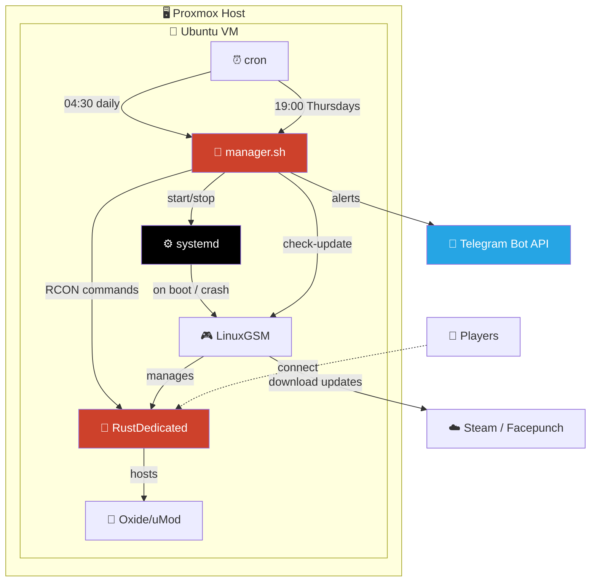
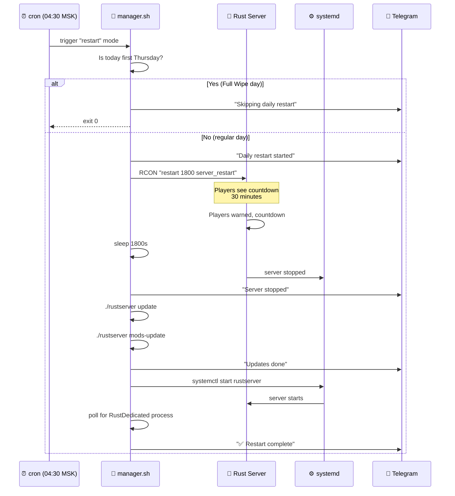
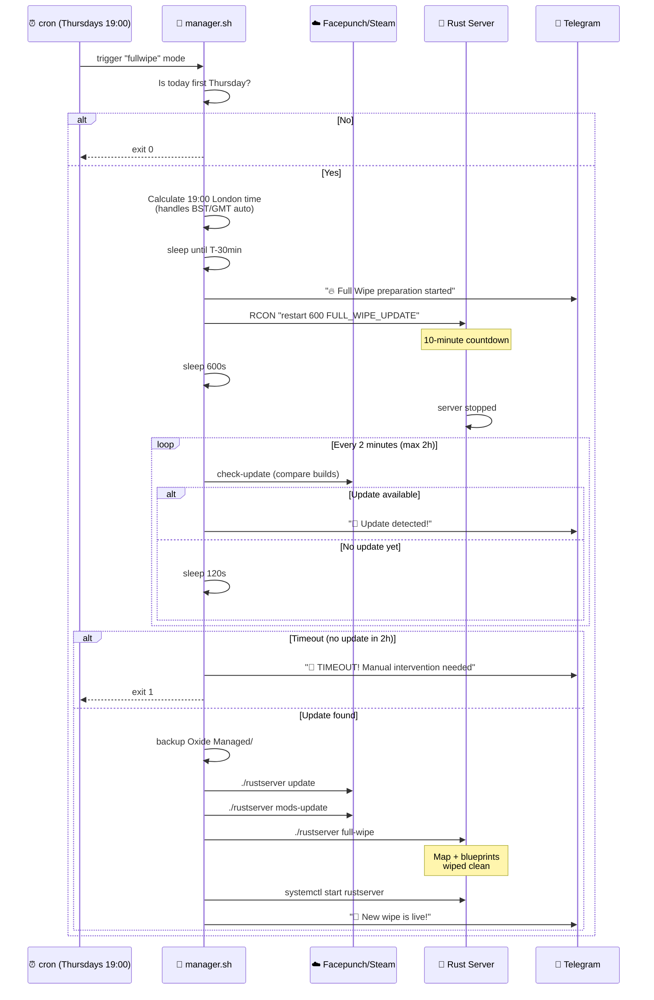

<div align="center">

# 🦀 Rust Wipe Manager

### Production-ready automation toolkit for Rust game servers running LinuxGSM

[](https://opensource.org/licenses/MIT)
[](https://www.gnu.org/software/bash/)
[](https://ubuntu.com/)
[](https://systemd.io/)
[](https://linuxgsm.com/)
[](https://telegram.org/)
[](https://rust.facepunch.com/)

**Daily restarts • Smart Full Wipe automation • Update detection • Telegram alerts • Self-healing**

[Features](#-features) • [How it works](#-how-it-works) • [Installation](#-installation) • [Configuration](#-configuration) • [Troubleshooting](#-troubleshooting)

</div>

---

## 📖 Overview

**Rust Wipe Manager** is a complete automation toolkit for [Rust](https://rust.facepunch.com/) game servers running on [LinuxGSM](https://linuxgsm.com/). It handles the boring parts of running a Rust server so you don't have to: daily restarts, monthly Full Wipes synced with Facepunch's update cycle, server crash recovery, OS updates, and detailed Telegram notifications at every step.

The toolkit was built and battle-tested on a real production server (`bzod.ru`) running on **Ubuntu 24.04 LTS** + **Proxmox VM** + **LinuxGSM** + **uMod (Oxide)**.

## ✨ Features

### 🔄 Smart daily restarts
- Player warning via RCON with countdown (configurable, default 30 minutes)
- Graceful shutdown with fallback to `systemctl stop` if hung
- Automatic Rust + Oxide updates during restart
- Skips itself on Full Wipe day to avoid conflict

### 🔥 Automatic Full Wipe on the first Thursday of every month
- Syncs with Facepunch's official patch cadence (19:00 London time)
- **Waits for the actual update to appear in Steam** before wiping (no risk of wiping on old version)
- Polls Steam every 2 minutes for up to 2 hours
- Aborts wipe with critical Telegram alert if update doesn't appear in time
- Backs up Oxide `Managed/` directory before update

### 🛡️ systemd integration
- Auto-start on machine boot
- Auto-restart on crash (via LGSM monitor)
- Logs accessible via `journalctl -u rustserver`
- Clean `start`/`stop`/`restart` interface

### 📱 Telegram notifications at every step
- Restart started / RCON sent / server stopped / update done / server back up
- Three log levels: `full` / `success_error` / `error_only`
- Critical alerts on failures (timeout, update error, server didn't start)

### 🔐 Security-conscious
- All secrets stored in a separate `.secrets.env` file with `chmod 600`
- Sudo restricted to specific `systemctl` commands only
- No credentials in the main script — safe to publish

## 🏗️ Architecture



## 🎯 How it works

### Daily restart flow



### Full Wipe flow



## 🛠️ Tech Stack

| Component | Purpose |
|---|---|
|  | Main scripting language |
|  | Host OS |
|  | Service management & auto-start |
|  | Game server wrapper |
|  | The game itself |
|  | Plugin framework |
|  | Task scheduling |
|  | RCON communication |
|  | Notifications |

## 📋 Requirements

- **OS**: Ubuntu 24.04 LTS (or any modern Debian-based distro with systemd)
- **LinuxGSM** installed and `rustserver` configured at `~/rustserver`
- **Rust dedicated server** running via LGSM
- **systemd** (built into modern distros)
- **rcon-cli** by gorcon: [github.com/gorcon/rcon-cli](https://github.com/gorcon/rcon-cli)
- **Telegram bot** (optional but recommended) — get token from [@BotFather](https://t.me/BotFather)
- **sudo** rights for the user running the server (limited to `systemctl`)

## 🚀 Installation

### 1️⃣ Install LinuxGSM and Rust server

```bash
curl -Lo linuxgsm.sh https://linuxgsm.sh && chmod +x linuxgsm.sh && bash linuxgsm.sh rustserver
./rustserver auto-install
```

### 2️⃣ Install rcon-cli

```bash
cd ~
wget https://github.com/gorcon/rcon-cli/releases/download/v0.10.3/rcon-0.10.3-amd64_linux.tar.gz
tar -xzf rcon-0.10.3-amd64_linux.tar.gz
rm rcon-0.10.3-amd64_linux.tar.gz
```

### 3️⃣ Set up systemd service

Create `/etc/systemd/system/rustserver.service`:

```ini
[Unit]
Description=Rust Server (LinuxGSM)
After=network-online.target
Wants=network-online.target

[Service]
Type=oneshot
RemainAfterExit=yes
User=YOUR_USERNAME
Group=YOUR_USERNAME
WorkingDirectory=/home/YOUR_USERNAME
ExecStart=/home/YOUR_USERNAME/rustserver start
ExecStop=/home/YOUR_USERNAME/rustserver stop
TimeoutStartSec=600
TimeoutStopSec=300

[Install]
WantedBy=multi-user.target
```

Enable and start:
```bash
sudo systemctl daemon-reload
sudo systemctl enable rustserver
sudo systemctl start rustserver
```

> ⚠️ **Why `Type=oneshot` and not `Type=forking`?** LinuxGSM uses tmux internally and detaches the process. With `Type=forking` systemd loses track of the actual server process. `Type=oneshot` + `RemainAfterExit=yes` is the cleanest solution that works reliably with LGSM.

### 4️⃣ Set up sudoers (passwordless systemctl)

```bash
echo 'YOUR_USERNAME ALL=(root) NOPASSWD: /usr/bin/systemctl start rustserver, /usr/bin/systemctl stop rustserver, /usr/bin/systemctl restart rustserver' | sudo tee /etc/sudoers.d/YOUR_USERNAME-rustserver
sudo chmod 440 /etc/sudoers.d/YOUR_USERNAME-rustserver
```

### 5️⃣ Clone this repo

```bash
mkdir -p ~/rust_server
cd ~/rust_server
wget https://raw.githubusercontent.com/wobujidao/rust-wipe-manager/main/manager.sh
wget https://raw.githubusercontent.com/wobujidao/rust-wipe-manager/main/config.env.example -O config.env
wget https://raw.githubusercontent.com/wobujidao/rust-wipe-manager/main/secrets.env.example -O .secrets.env
chmod +x manager.sh
chmod 600 .secrets.env
```

### 6️⃣ Configure secrets and config

Edit `.secrets.env` with your real values:
```bash
nano ~/rust_server/.secrets.env
```

```env
TELEGRAM_BOT_TOKEN="123456789:AAAAAAAAAAAAAAAAAAAAAAAAAAAAAAAAAAA"
TELEGRAM_CHAT_ID="-1001234567890"
RCON_PASS="your_rcon_password_here"
```

Edit `config.env` to match your paths and preferences:
```bash
nano ~/rust_server/config.env
```

### 7️⃣ Test it

```bash
~/rust_server/manager.sh test-telegram
~/rust_server/manager.sh check-update
```

You should get a Telegram message and see version info from Steam.

### 8️⃣ Add cron tasks

```bash
crontab -e
```

Add:
```cron
30 4 * * * /home/YOUR_USERNAME/rust_server/manager.sh restart
0 19 * * 4 /home/YOUR_USERNAME/rust_server/manager.sh fullwipe
```

> 💡 The Full Wipe task runs **every Thursday** at 19:00, but the script itself checks if today is the first Thursday of the month and exits immediately on other Thursdays.

## ⚙️ Configuration

All settings live in `config.env`. The most important ones:

| Parameter | Default | Description |
|---|---|---|
| `DAILY_RESTART_COUNTDOWN` | `1800` | Countdown before daily restart (seconds) |
| `DAILY_RESTART_UPDATE_RUST` | `true` | Update Rust during daily restart |
| `DAILY_RESTART_UPDATE_OXIDE` | `true` | Update Oxide during daily restart |
| `FULLWIPE_COUNTDOWN` | `600` | Countdown before Full Wipe stop (seconds) |
| `FULLWIPE_LONDON_HOUR` | `19` | Hour in London time when Facepunch releases updates |
| `FULLWIPE_PRE_WAIT_MINUTES` | `30` | Start preparing this many minutes before update |
| `FULLWIPE_UPDATE_WAIT_MAX` | `7200` | Maximum time to wait for Steam update (seconds) |
| `FULLWIPE_UPDATE_CHECK_INTERVAL` | `120` | Check Steam every N seconds |
| `SKIP_DAILY_RESTART_ON_FULLWIPE_DAY` | `true` | Skip daily restart on Full Wipe Thursday |
| `OXIDE_BACKUP_BEFORE_UPDATE` | `true` | Backup `Managed/` before Oxide update |
| `SERVER_START_TIMEOUT` | `600` | Max time to wait for RustDedicated process |
| `ENABLE_TELEGRAM` | `true` | Enable Telegram notifications |
| `TELEGRAM_LOG_LEVEL` | `full` | `full` / `success_error` / `error_only` |

## 🎮 Commands

```bash
# Daily restart (with auto-skip on Full Wipe day)
./manager.sh restart

# Full Wipe (only runs if today is first Thursday)
./manager.sh fullwipe

# Manual Full Wipe — bypasses date check (USE WITH CAUTION)
./manager.sh fullwipe-now

# Test Telegram notifications
./manager.sh test-telegram

# Check if Steam has a Rust update
./manager.sh check-update
```

## 📁 Project structure

```
rust_server/
├── manager.sh           # Main script
├── config.env           # Configuration (paths, timings, flags)
├── .secrets.env         # Telegram token, RCON password (chmod 600)
└── logs/
    └── manager-YYYYMMDD.log
```

## 🔧 Troubleshooting

### Server doesn't auto-start after reboot
Check the systemd unit:
```bash
sudo systemctl status rustserver
sudo systemctl is-enabled rustserver
journalctl -u rustserver -n 50
```
Make sure it's `enabled` and `Type=oneshot` (not `forking`).

### `sudo: a password is required` from cron
The `sudoers.d/` rule wasn't applied correctly. Verify:
```bash
sudo -n systemctl status rustserver
```
Should show status without asking for a password.

### Full Wipe ran but server is on old version
The `wait_for_rust_update` loop should prevent this. If it happened anyway:
1. Check `~/rust_server/logs/manager-*.log` for the wait phase
2. Verify `check-update` returns the correct build numbers manually
3. Increase `FULLWIPE_UPDATE_WAIT_MAX` if Facepunch was extra late

### Oxide won't load after Full Wipe
Oxide releases sometimes lag behind Rust releases by 30-90 minutes. If `mods-update` ran too early, you may have an incompatible version. Solutions:
- Wait 30 minutes and run `~/rustserver mods-update` manually, then restart
- Restore from auto-backup: `~/serverfiles/RustDedicated_Data/Managed.backup-YYYY-MM-DD/`

### Telegram messages not arriving
```bash
~/rust_server/manager.sh test-telegram
```
If nothing arrives, verify:
- Bot token is correct in `.secrets.env`
- Chat ID is correct (negative for groups, positive for direct chats)
- Bot has been added to the group/channel
- `curl https://api.telegram.org/botYOUR_TOKEN/getMe` returns `"ok":true`

## 🗺️ Roadmap

- [ ] Discord webhook support (alongside Telegram)
- [ ] Web dashboard for log viewing
- [ ] Map seed rotation automation
- [ ] Integration with `BattleMetrics` API for player count alerts
- [ ] Plugin update notifications (when popular plugins get updates)
- [ ] Multi-server support (one manager, multiple servers)

## 🤝 Contributing

PRs and issues welcome. This project is built for real production use, so please test changes against a real LGSM Rust server before submitting.

## 📜 License

MIT — do whatever you want with this code, just don't blame me if your server explodes.

## 🙏 Credits

- [LinuxGSM](https://linuxgsm.com/) — the unsung hero of game server hosting
- [gorcon/rcon-cli](https://github.com/gorcon/rcon-cli) — clean RCON client
- [Facepunch Studios](https://facepunch.com/) — for making Rust
- [uMod / Oxide](https://umod.org/) — for the plugin ecosystem

---

<div align="center">

**Built for [bzod.ru](https://bzod.ru) — battle-tested in production**

If this saved you time, ⭐ star the repo!

</div>
