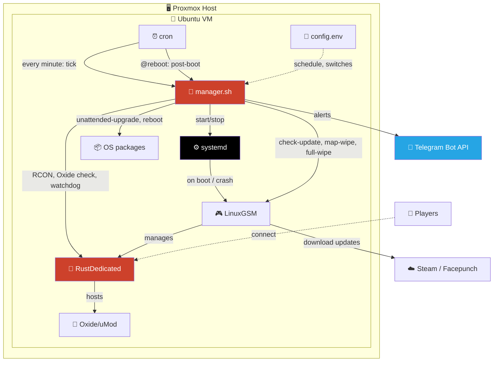
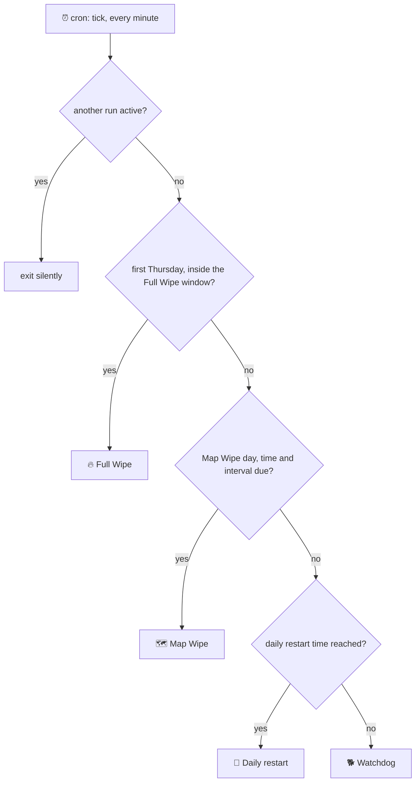
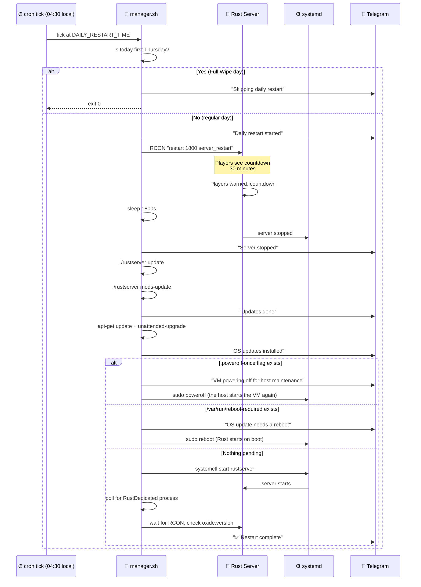
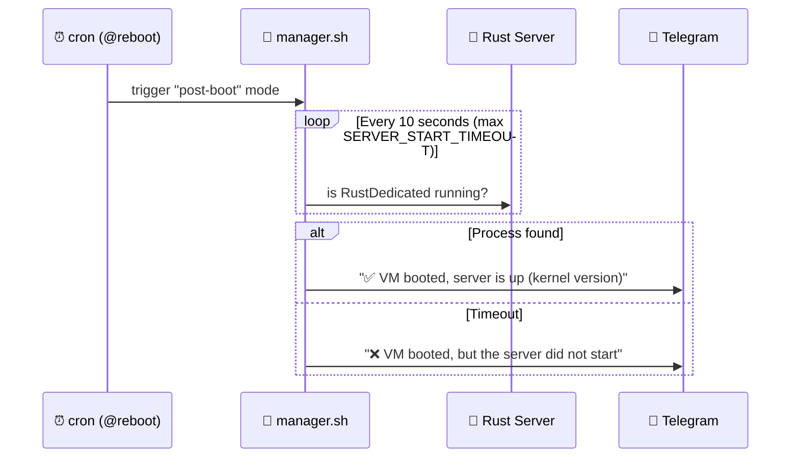
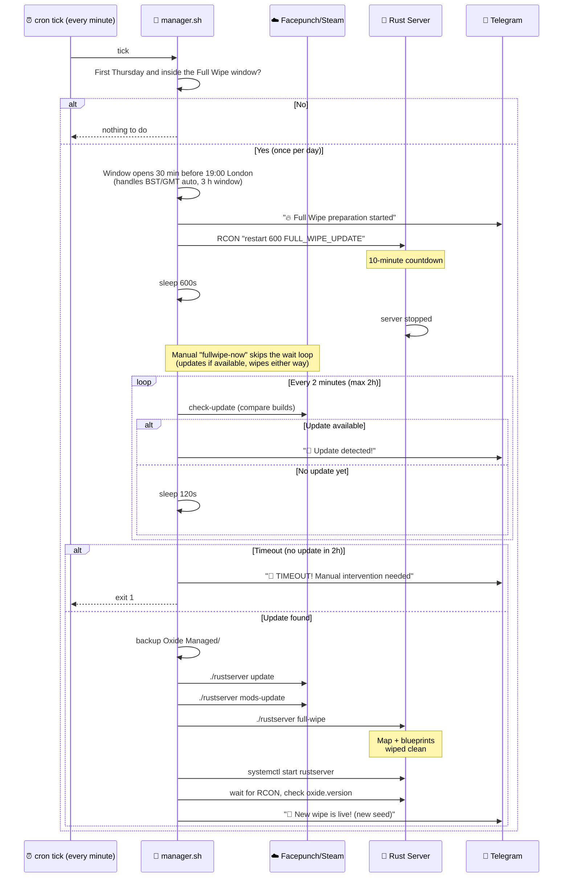
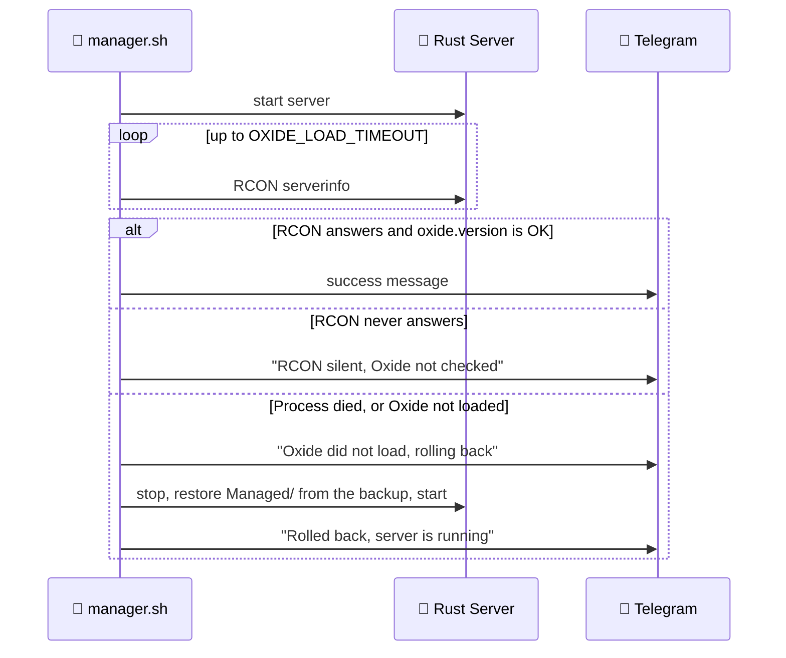
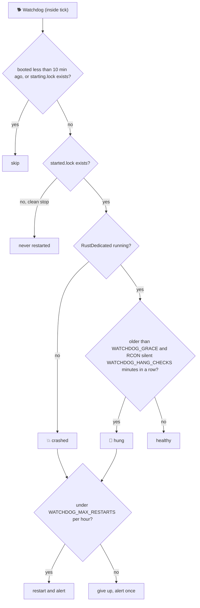

<div align="center">

# 🦀 Rust Wipe Manager

### Production-ready automation toolkit for Rust game servers running LinuxGSM

[](https://opensource.org/licenses/MIT)
[](https://www.gnu.org/software/bash/)
[](https://ubuntu.com/)
[](https://systemd.io/)
[](https://linuxgsm.com/)
[](https://telegram.org/)
[](https://rust.facepunch.com/)

**Daily restarts • Smart Full Wipe automation • Optional Map Wipes • Watchdog • Update detection • Telegram alerts • Self-healing**

[Features](#-features) • [How it works](#-how-it-works) • [Installation](#-installation) • [Configuration](#-configuration) • [Troubleshooting](#-troubleshooting)

</div>

---

## 📖 Overview

**Rust Wipe Manager** is a complete automation toolkit for [Rust](https://rust.facepunch.com/) game servers running on [LinuxGSM](https://linuxgsm.com/). It handles the boring parts of running a Rust server so you don't have to: daily restarts, monthly Full Wipes synced with Facepunch's update cycle, server crash recovery, OS updates, and detailed Telegram notifications at every step.

The toolkit was built and battle-tested on a real production server (`bzod.ru`) running on **Ubuntu 24.04 LTS** + **Proxmox VM** + **LinuxGSM** + **uMod (Oxide)**.

## ✨ Features

### 🔄 Smart daily restarts
- Starts at `DAILY_RESTART_TIME` (default 04:30, VM local time) — no separate cron line needed
- Player warning via RCON with countdown (configurable, default 30 minutes)
- Graceful shutdown with fallback to `systemctl stop` if hung
- Automatic Rust + Oxide updates during restart
- OS package updates (`unattended-upgrade`) in the same window, while the server is down
- Reboots the VM instead of starting the server when the OS asks for it (the systemd unit starts Rust on boot)
- One-time power-off flag (`.poweroff-once`) for host-side maintenance
- Oxide check after every start, with automatic rollback if Oxide did not load
- Skips itself on Full Wipe day to avoid conflict

### 🔥 Automatic Full Wipe on the first Thursday of every month
- Syncs with Facepunch's official patch cadence (19:00 London time)
- Starts by itself at (London hour − pre-wait) inside a 3-hour window
- **Waits for the actual update to appear in Steam** before wiping (no risk of wiping on old version)
- Polls Steam every 2 minutes for up to 2 hours
- Aborts wipe with critical Telegram alert if update doesn't appear in time
- Manual `fullwipe-now` does **not** wait: it updates if an update is available and wipes either way
- Fresh random map seed on every Full Wipe (done by LinuxGSM when `seed` is empty, see [Map seed](#-map-seed))
- Backs up Oxide `Managed/` directory before update

### 🗺️ Optional Map Wipes between the monthly Full Wipes
- Weekly, every two weeks, ... on a day and time of your choice (`MAPWIPE_*`), off by default
- Uses LGSM `map-wipe`: map only, blueprints kept, new random seed
- Never waits for a Facepunch update; the interval is counted from the last wipe of any kind, so it lines up with the forced monthly wipe
- Skipped on the Full Wipe day

### 🗓️ One cron line, schedule in `config.env`
- `* * * * * manager.sh tick` reads `config.env` every minute and runs whatever is due: daily restart, Full Wipe, Map Wipe — otherwise the watchdog
- Change times, days and intervals in `config.env` without touching cron
- Each event fires once per day inside a window; a VM that was off at that time skips it instead of running hours late
- Only one run at a time (`flock`): a second manual run is cancelled with a Telegram alert

### 🐕 Watchdog
- Restarts a crashed server and a hung one (process alive, but RCON silent for several minutes in a row)
- Respects a clean stop (`./rustserver stop`, `systemctl stop rustserver`) and never restarts it
- Gives up and alerts once if the server keeps dying (`WATCHDOG_MAX_RESTARTS` per hour)

### 🧩 Oxide safety net
- After every start (daily restart and wipes) waits for RCON and checks `oxide.version`
- If Oxide did not load, or the server died while loading: stop, restore `Managed/` from the backup made before this run's Oxide update, start again, alert

### 🛡️ systemd integration
- Auto-start on machine boot
- Crash and hang recovery by the built-in watchdog (see above)
- Logs accessible via `journalctl -u rustserver`
- Clean `start`/`stop`/`restart` interface

### 📱 Telegram notifications at every step
- Restart started / RCON sent / server stopped / update done / server back up
- After any VM boot: server is up (with kernel version) or failed to start (`post-boot`)
- Three log levels: `full` / `success_error` / `error_only`
- Messages in English or Russian (`MESSAGES_LANG=en|ru`)
- Sent as URL-encoded plain text (no Markdown quirks: `+` and `_` arrive intact)
- The "new wipe is live" message includes the new map seed
- Critical alerts on failures (timeout, update error, server didn't start, Oxide rollback, watchdog gave up)

### 🔐 Security-conscious
- All secrets stored in a separate `.secrets.env` file with `chmod 600`
- Sudo restricted to a short list of commands: `systemctl` for the service, `apt-get update -qq`, `unattended-upgrade`, `reboot`, `poweroff`
- No credentials in the main script — safe to publish

## 🏗️ Architecture


```mermaid
graph TB
    subgraph "🖥️ Proxmox Host"
        subgraph "🐧 Ubuntu VM"
            CRON[⏰ cron]
            SYSTEMD[⚙️ systemd]
            MANAGER[📜 manager.sh]
            LGSM[🎮 LinuxGSM]
            RUST[🦀 RustDedicated]
            OXIDE[🔧 Oxide/uMod]
            OS[📦 OS packages]
            CONF[📄 config.env]
        end
    end

    TG[📱 Telegram Bot API]
    STEAM[☁️ Steam / Facepunch]
    PLAYERS[👥 Players]

    CRON -->|"every minute: tick"| MANAGER
    CRON -->|"@reboot: post-boot"| MANAGER
    CONF -.->|"schedule, switches"| MANAGER
    SYSTEMD -->|"on boot / crash"| LGSM
    MANAGER -->|"start/stop"| SYSTEMD
    MANAGER -->|"RCON, Oxide check, watchdog"| RUST
    MANAGER -->|"check-update, map-wipe, full-wipe"| LGSM
    MANAGER -->|"unattended-upgrade, reboot"| OS
    MANAGER -->|"alerts"| TG
    LGSM -->|"download updates"| STEAM
    LGSM -->|"manages"| RUST
    RUST -->|"hosts"| OXIDE
    PLAYERS -.->|"connect"| RUST

    style MANAGER fill:#CD412B,color:#fff
    style RUST fill:#CD412B,color:#fff
    style TG fill:#26A5E4,color:#fff
    style SYSTEMD fill:#000,color:#fff
```

## 🎯 How it works

### Scheduler (`tick`)


```mermaid
graph TD
    TICK["⏰ cron: tick, every minute"] --> LOCK{"another run active?"}
    LOCK -->|"yes"| EXIT["exit silently"]
    LOCK -->|"no"| FW{"first Thursday, inside the Full Wipe window?"}
    FW -->|"yes"| FWRUN["🔥 Full Wipe"]
    FW -->|"no"| MW{"Map Wipe day, time and interval due?"}
    MW -->|"yes"| MWRUN["🗺️ Map Wipe"]
    MW -->|"no"| DR{"daily restart time reached?"}
    DR -->|"yes"| DRRUN["🔄 Daily restart"]
    DR -->|"no"| WD["🐕 Watchdog"]
```

`tick` re-reads `config.env` on every run. Times are the VM's local time.

- **Daily restart** — at `DAILY_RESTART_TIME`.
- **Full Wipe** — first Thursday, starting at (London `FULLWIPE_LONDON_HOUR` − `FULLWIPE_PRE_WAIT_MINUTES`), inside a 3-hour window.
- **Map Wipe** — on `MAPWIPE_DAY` (1=Mon … 7=Sun) at `MAPWIPE_TIME`, every `MAPWIPE_INTERVAL_WEEKS`, counted from the last wipe of any kind (the newest `*.map` file's modification time), and only on `MAPWIPE_MONTH_DAYS` when that is set. Skipped on the Full Wipe day.
- **Once per day, inside a window** — each event fires once per day, inside a window (1 hour for the restart and Map Wipe, 3 hours for the Full Wipe). A VM that was off at that time skips the event instead of running it hours late. The "done" stamps live in `.state/done-*`.
- **Otherwise** — `tick` runs the watchdog.
- **Legacy commands** — `restart` runs a daily restart immediately; `fullwipe` is the old cron entry (Full Wipe on the first Thursday only).

### Daily restart flow


```mermaid
sequenceDiagram
    participant C as ⏰ cron tick (04:30 local)
    participant M as 📜 manager.sh
    participant R as 🦀 Rust Server
    participant S as ⚙️ systemd
    participant T as 📱 Telegram

    C->>M: tick at DAILY_RESTART_TIME
    M->>M: Is today first Thursday?
    alt Yes (Full Wipe day)
        M->>T: "Skipping daily restart"
        M-->>C: exit 0
    else No (regular day)
        M->>T: "Daily restart started"
        M->>R: RCON "restart 1800 server_restart"
        Note over R: Players see countdown<br/>30 minutes
        R->>R: Players warned, countdown
        M->>M: sleep 1800s
        R->>S: server stopped
        M->>T: "Server stopped"
        M->>M: ./rustserver update
        M->>M: ./rustserver mods-update
        M->>T: "Updates done"
        M->>M: apt-get update + unattended-upgrade
        M->>T: "OS updates installed"
        alt .poweroff-once flag exists
            M->>T: "VM powering off for host maintenance"
            M->>S: sudo poweroff (the host starts the VM again)
        else /var/run/reboot-required exists
            M->>T: "OS update needs a reboot"
            M->>S: sudo reboot (Rust starts on boot)
        else Nothing pending
            M->>S: systemctl start rustserver
            S->>R: server starts
            M->>M: poll for RustDedicated process
            M->>R: wait for RCON, check oxide.version
            M->>T: "✅ Restart complete"
        end
    end
```

The OS maintenance steps (`update_system`, `reboot_if_required`) run after the Rust/Oxide updates, while the server is down:

- **OS updates** — `apt-get update -qq` + `unattended-upgrade`, controlled by `SYSTEM_UPDATE_ENABLED`. What gets installed is Ubuntu's own setting (`Unattended-Upgrade::Allowed-Origins` in `/etc/apt/apt.conf.d/50unattended-upgrades`; by default security updates); this window only decides *when*. For updates to land only here, turn off the stock apt timer (see Installation, step 4). The log is `/var/log/unattended-upgrades/unattended-upgrades.log`.
- **Reboot** — controlled by `REBOOT_IF_REQUIRED`. If `/var/run/reboot-required` exists, the VM reboots instead of starting the server; the systemd unit starts Rust on boot.
- **One-time power-off** — `touch ~/rust_server/.poweroff-once` makes the next daily restart power the VM off instead of starting the server (for host-side maintenance, e.g. Proxmox `qm enroll-efi-keys <vmid>`, which needs the VM shut down). The flag is deleted when used, and the host has to start the VM again.

### Post-boot report


```mermaid
sequenceDiagram
    participant C as ⏰ cron (@reboot)
    participant M as 📜 manager.sh
    participant R as 🦀 Rust Server
    participant T as 📱 Telegram

    C->>M: trigger "post-boot" mode
    loop Every 10 seconds (max SERVER_START_TIMEOUT)
        M->>R: is RustDedicated running?
    end
    alt Process found
        M->>T: "✅ VM booted, server is up (kernel version)"
    else Timeout
        M->>T: "❌ VM booted, but the server did not start"
    end
```

### Full Wipe flow


```mermaid
sequenceDiagram
    participant C as ⏰ cron tick (every minute)
    participant M as 📜 manager.sh
    participant FP as ☁️ Facepunch/Steam
    participant R as 🦀 Rust Server
    participant T as 📱 Telegram

    C->>M: tick
    M->>M: First Thursday and inside the Full Wipe window?
    alt No
        M-->>C: nothing to do
    else Yes (once per day)
        M->>M: Window opens 30 min before 19:00 London<br/>(handles BST/GMT auto, 3 h window)
        M->>T: "🔥 Full Wipe preparation started"
        M->>R: RCON "restart 600 FULL_WIPE_UPDATE"
        Note over R: 10-minute countdown
        M->>M: sleep 600s
        R->>R: server stopped

        Note over M,FP: Manual "fullwipe-now" skips the wait loop<br/>(updates if available, wipes either way)
        loop Every 2 minutes (max 2h)
            M->>FP: check-update (compare builds)
            alt Update available
                M->>T: "🎉 Update detected!"
            else No update yet
                M->>M: sleep 120s
            end
        end

        alt Timeout (no update in 2h)
            M->>T: "🚨 TIMEOUT! Manual intervention needed"
            M-->>C: exit 1
        else Update found
            M->>M: backup Oxide Managed/
            M->>FP: ./rustserver update
            M->>FP: ./rustserver mods-update
            M->>R: ./rustserver full-wipe
            Note over R: Map + blueprints<br/>wiped clean
            M->>R: systemctl start rustserver
            M->>R: wait for RCON, check oxide.version
            M->>T: "🎉 New wipe is live! (new seed)"
        end
    end
```

> 💡 The wait loop belongs to the scheduled Full Wipe (first Thursday). A manual `fullwipe-now` and the Map Wipes do not wait for Facepunch: they run `./rustserver update` (which updates only if a new build is out) and then wipe either way.

### Map Wipe

Enabled with `MAPWIPE_ENABLED="true"`. On `MAPWIPE_DAY` at `MAPWIPE_TIME` the countdown (`FULLWIPE_COUNTDOWN`) starts, the server stops, Rust and Oxide are updated if updates are out, then LGSM `map-wipe` runs (blueprints kept, new random seed like `full-wipe`), the server starts, the Oxide check runs and the "new wipe is live" message with the seed is sent. It never waits for a Facepunch update. Run one by hand with `./manager.sh mapwipe-now`.

### Oxide check after every start


```mermaid
sequenceDiagram
    participant M as 📜 manager.sh
    participant R as 🦀 Rust Server
    participant T as 📱 Telegram

    M->>R: start server
    loop up to OXIDE_LOAD_TIMEOUT
        M->>R: RCON serverinfo
    end
    alt RCON answers and oxide.version is OK
        M->>T: success message
    else RCON never answers
        M->>T: "RCON silent, Oxide not checked"
    else Process died, or Oxide not loaded
        M->>T: "Oxide did not load, rolling back"
        M->>R: stop, restore Managed/ from the backup, start
        M->>T: "Rolled back, server is running"
    end
```

- Controlled by `OXIDE_CHECK_ENABLED`. The backup is the `Managed.backup-<date>` copy made right before this run's Oxide update, so there is nothing to roll back to when the run did not update Oxide (you get an alert instead).
- ⚠️ If Rust itself was updated in the same run, that copy is vanilla (no Oxide): the server runs without plugins until uMod ships a fix.
- `OXIDE_LOAD_TIMEOUT` must cover map generation after a wipe — it can take 10+ minutes on slow hardware.

### Watchdog


```mermaid
graph TD
    W["🐕 Watchdog (inside tick)"] --> B{"booted less than 10 min ago, or starting.lock exists?"}
    B -->|"yes"| SKIP["skip"]
    B -->|"no"| L{"started.lock exists?"}
    L -->|"no, clean stop"| NEVER["never restarted"]
    L -->|"yes"| P{"RustDedicated running?"}
    P -->|"no"| CR["💥 crashed"]
    P -->|"yes"| H{"older than WATCHDOG_GRACE and RCON silent WATCHDOG_HANG_CHECKS minutes in a row?"}
    H -->|"yes"| HU["🧊 hung"]
    H -->|"no"| OK["healthy"]
    CR --> LIM{"under WATCHDOG_MAX_RESTARTS per hour?"}
    HU --> LIM
    LIM -->|"yes"| RS["restart and alert"]
    LIM -->|"no"| GU["give up, alert once"]
```

- Runs inside `tick` every minute (or by hand: `./manager.sh watchdog`).
- A **crashed** server is one with no `RustDedicated` process while LGSM's `lgsm/lock/rustserver-started.lock` exists. A **hung** one has a process older than `WATCHDOG_GRACE` whose RCON `serverinfo` stays silent `WATCHDOG_HANG_CHECKS` minutes in a row.
- A clean stop (`./rustserver stop` or `systemctl stop rustserver`) removes `started.lock`, so the server is never restarted. A console/RCON `quit` leaves it, so the watchdog restarts the server — see Troubleshooting.
- It skips the first 10 minutes after boot (`post-boot` covers that) and any time LGSM's `starting.lock` exists.
- After `WATCHDOG_MAX_RESTARTS` restarts within an hour it gives up and alerts once; `.state/gave_up` is cleared when the server is healthy again.

### One run at a time, and logs

- `manager.sh` takes a `flock` on `.manager.lock`. A second manual or cron run is cancelled with a Telegram alert; `tick` and `watchdog` exit silently when busy. LGSM and rcon run with file descriptor 9 closed, so the lock never leaks into tmux.
- `manager-*.log` files older than `LOG_KEEP_DAYS` are deleted; `cron.log` is rotated to `cron.log.1` at 10 MB.

## 🛠️ Tech Stack

| Component | Purpose |
|---|---|
|  | Main scripting language |
|  | Host OS |
|  | Service management & auto-start |
|  | Game server wrapper |
|  | The game itself |
|  | Plugin framework |
|  | Task scheduling |
|  | RCON communication |
|  | Notifications |

## 📋 Requirements

- **OS**: Ubuntu 24.04 LTS (or any modern Debian-based distro with systemd)
- **LinuxGSM** installed and `rustserver` configured at `~/rustserver`
- **Rust dedicated server** running via LGSM
- **systemd** (built into modern distros)
- **rcon-cli** by gorcon: [github.com/gorcon/rcon-cli](https://github.com/gorcon/rcon-cli)
- **Telegram bot** (optional but recommended) — get token from [@BotFather](https://t.me/BotFather)
- **sudo** rights for the user running the server (limited to `systemctl`, `apt-get update -qq`, `unattended-upgrade`, `reboot`, `poweroff`)

## 🚀 Installation

### 1️⃣ Install LinuxGSM and Rust server

```bash
curl -Lo linuxgsm.sh https://linuxgsm.sh && chmod +x linuxgsm.sh && bash linuxgsm.sh rustserver
./rustserver auto-install
```

### 2️⃣ Install rcon-cli

```bash
cd ~
wget https://github.com/gorcon/rcon-cli/releases/download/v0.10.3/rcon-0.10.3-amd64_linux.tar.gz
tar -xzf rcon-0.10.3-amd64_linux.tar.gz
rm rcon-0.10.3-amd64_linux.tar.gz
```

### 3️⃣ Set up systemd service

Create `/etc/systemd/system/rustserver.service`:

```ini
[Unit]
Description=Rust Server (LinuxGSM)
After=network-online.target
Wants=network-online.target

[Service]
Type=oneshot
RemainAfterExit=yes
User=YOUR_USERNAME
Group=YOUR_USERNAME
WorkingDirectory=/home/YOUR_USERNAME
ExecStart=/home/YOUR_USERNAME/rustserver start
ExecStop=/home/YOUR_USERNAME/rustserver stop
TimeoutStartSec=600
TimeoutStopSec=300

[Install]
WantedBy=multi-user.target
```

Enable and start:
```bash
sudo systemctl daemon-reload
sudo systemctl enable rustserver
sudo systemctl start rustserver
```

> ⚠️ **Why `Type=oneshot` and not `Type=forking`?** LinuxGSM uses tmux internally and detaches the process. With `Type=forking` systemd loses track of the actual server process. `Type=oneshot` + `RemainAfterExit=yes` is the cleanest solution that works reliably with LGSM.

### 4️⃣ Set up sudoers (passwordless systemctl, apt, reboot)

```bash
echo 'YOUR_USERNAME ALL=(root) NOPASSWD: /usr/bin/systemctl start rustserver, /usr/bin/systemctl stop rustserver, /usr/bin/systemctl restart rustserver, /usr/bin/apt-get update -qq, /usr/bin/unattended-upgrade, /usr/sbin/reboot, /usr/sbin/poweroff' | sudo tee /etc/sudoers.d/YOUR_USERNAME-rustserver
sudo chmod 440 /etc/sudoers.d/YOUR_USERNAME-rustserver
```

**Recommended:** disable the stock unattended-upgrade timer so OS upgrades land only in the daily restart window, while the server is down. In `/etc/apt/apt.conf.d/20auto-upgrades` keep the package list refresh and turn off the periodic upgrade:

```
APT::Periodic::Update-Package-Lists "1";
APT::Periodic::Unattended-Upgrade "0";
```

### 5️⃣ Clone this repo

```bash
mkdir -p ~/rust_server
cd ~/rust_server
wget https://raw.githubusercontent.com/wobujidao/rust-wipe-manager/main/manager.sh
wget https://raw.githubusercontent.com/wobujidao/rust-wipe-manager/main/config.env.example -O config.env
wget https://raw.githubusercontent.com/wobujidao/rust-wipe-manager/main/secrets.env.example -O .secrets.env
chmod +x manager.sh
chmod 600 .secrets.env
```

### 6️⃣ Configure secrets and config

Edit `.secrets.env` with your real values:
```bash
nano ~/rust_server/.secrets.env
```

```env
TELEGRAM_BOT_TOKEN="123456789:AAAAAAAAAAAAAAAAAAAAAAAAAAAAAAAAAAA"
TELEGRAM_CHAT_ID="-1001234567890"
RCON_PASS="your_rcon_password_here"
```

Edit `config.env` to match your paths and preferences:
```bash
nano ~/rust_server/config.env
```

### 7️⃣ Test it

```bash
~/rust_server/manager.sh test-telegram
~/rust_server/manager.sh check-update
```

You should get a Telegram message and see version info from Steam.

### 8️⃣ Add cron tasks

```bash
crontab -e
```

Add:
```cron
* * * * * /home/YOUR_USERNAME/rust_server/manager.sh tick >> /home/YOUR_USERNAME/rust_server/logs/cron.log 2>&1
@reboot /home/YOUR_USERNAME/rust_server/manager.sh post-boot >> /home/YOUR_USERNAME/rust_server/logs/cron.log 2>&1
```

> 💡 `tick` runs every minute, reads `config.env` and starts whatever is due: the daily restart at `DAILY_RESTART_TIME`, the Full Wipe on the first Thursday from (London `FULLWIPE_LONDON_HOUR` − `FULLWIPE_PRE_WAIT_MINUTES`), the optional Map Wipe. When nothing is due it runs the watchdog. See [Scheduler](#scheduler-tick) for the details.

> 🕒 All times are in the **VM's local timezone**. An event that was missed because the VM was off is skipped, not run hours late.

> 📣 The `@reboot` entry runs `post-boot` after every VM boot (including the reboots and power cycles triggered by the daily restart) and reports to Telegram whether the server came up.

#### Upgrading from the old cron lines

Older versions used one cron line per job (`... manager.sh restart` at 04:30 and `... manager.sh fullwipe` on Thursdays at 19:00). Remove both and add the `tick` line above, otherwise two runs fire at the same time and the lock cancels one of them with a Telegram alert. Then:

- Copy the new options from `config.env.example` to your `config.env`. An older `config.env` keeps working: missing options get defaults (daily restart at 04:30, Map Wipe off, OS updates and reboot off, Oxide check and watchdog on).
- If your `config.env` still has `OXIDE_LOAD_TIMEOUT=300`, raise it (the new default is `900`) so it covers map generation after a wipe.
- `fullwipe` still works as a legacy command (first Thursday only) and `restart` still runs a daily restart right away.

## ⚙️ Configuration

All settings live in `config.env`. [`config.env.example`](config.env.example) documents every setting inline, with a comment above each parameter. The most important ones:

| Parameter | Default | Description |
|---|---|---|
| `DAILY_RESTART_ENABLED` | `true` | Enable the daily restart |
| `DAILY_RESTART_TIME` | `04:30` | Daily restart time (VM local time) |
| `DAILY_RESTART_COUNTDOWN` | `1800` | Countdown before daily restart (seconds) |
| `DAILY_RESTART_UPDATE_RUST` | `true` | Update Rust during daily restart |
| `DAILY_RESTART_UPDATE_OXIDE` | `true` | Update Oxide during daily restart |
| `FULLWIPE_ENABLED` | `true` | Enable the Full Wipe |
| `FULLWIPE_COUNTDOWN` | `600` | Countdown before Full Wipe / Map Wipe stop (seconds) |
| `FULLWIPE_LONDON_HOUR` | `19` | Hour in London time when Facepunch releases updates |
| `FULLWIPE_PRE_WAIT_MINUTES` | `30` | Start preparing this many minutes before update |
| `FULLWIPE_UPDATE_WAIT_MAX` | `7200` | Maximum time the scheduled Full Wipe waits for the Steam update (seconds); `fullwipe-now` and Map Wipes do not wait |
| `FULLWIPE_UPDATE_CHECK_INTERVAL` | `120` | Check Steam every N seconds |
| `MAPWIPE_ENABLED` | `false` | Enable scheduled Map Wipes (map only, blueprints kept) |
| `MAPWIPE_DAY` | `5` | Day of week: 1=Mon … 7=Sun |
| `MAPWIPE_TIME` | `19:00` | Start time (VM local time); the countdown starts then |
| `MAPWIPE_INTERVAL_WEEKS` | `1` | 1 = every week, 2 = every two weeks, ...; counted from the last wipe of any kind |
| `MAPWIPE_MONTH_DAYS` | `""` | Days of the month, `FROM-TO` (e.g. `16-22`); empty = any day |
| `MAPWIPE_OPEN_TIME` | `""` | After a map wipe hold players in the connection queue (maxplayers 0) until HH:MM; empty = open when up |
| `FULLWIPE_OPEN_TIME` | `""` | Same for the Full Wipe |
| `WIPETIMER_ENABLED` | `false` | Show the next wipe from this schedule in the server browser (`wipetimer.wipeunixtimestampoverride`) |
| `SKIP_DAILY_RESTART_ON_FULLWIPE_DAY` | `true` | Skip daily restart on Full Wipe Thursday |
| `OXIDE_BACKUP_BEFORE_UPDATE` | `true` | Backup `Managed/` before Oxide update |
| `OXIDE_CHECK_ENABLED` | `true` | After a start: check `oxide.version`, roll `Managed/` back if Oxide is broken |
| `OXIDE_LOAD_TIMEOUT` | `900` | Max wait for RCON after a start (seconds); must cover map generation after a wipe |
| `SYSTEM_UPDATE_ENABLED` | `true` | Run `apt-get update` + `unattended-upgrade` in the daily restart window (server down) |
| `REBOOT_IF_REQUIRED` | `true` | If the OS needs a reboot, reboot the VM instead of starting the server |
| `SERVER_START_TIMEOUT` | `600` | Max time to wait for RustDedicated process (also used by `post-boot`) |
| `WATCHDOG_ENABLED` | `true` | Restart a crashed or hung server (a clean stop is respected) |
| `WATCHDOG_GRACE` | `1800` | Don't call a server hung until its process is this old (seconds) |
| `WATCHDOG_HANG_CHECKS` | `5` | RCON silent this many minutes in a row = hung |
| `WATCHDOG_MAX_RESTARTS` | `3` | Per hour; beyond that the watchdog gives up and alerts |
| `ENABLE_TELEGRAM` | `true` | Enable Telegram notifications |
| `TELEGRAM_LOG_LEVEL` | `full` | `full` / `success_error` / `error_only` |
| `MESSAGES_LANG` | `en` | Language of Telegram messages: `en` / `ru` |
| `LOG_KEEP_DAYS` | `30` | Delete `manager-*.log` older than this |

### 🗺️ Map Wipe schedule

Map Wipes are off by default. Examples:

```env
# Every Friday at 19:00
MAPWIPE_ENABLED="true"
MAPWIPE_DAY=5
MAPWIPE_TIME="19:00"
MAPWIPE_INTERVAL_WEEKS=1
```

```env
# Every two weeks on Monday at 18:00
MAPWIPE_ENABLED="true"
MAPWIPE_DAY=1
MAPWIPE_TIME="18:00"
MAPWIPE_INTERVAL_WEEKS=2
```

```env
# Twice a month: the forced first-Thursday wipe plus a map wipe on the Friday
# two weeks later (always the 16th-22nd)
MAPWIPE_ENABLED="true"
MAPWIPE_DAY=5
MAPWIPE_TIME="19:50"
MAPWIPE_INTERVAL_WEEKS=1
MAPWIPE_MONTH_DAYS="16-22"
```

### Opening at a fixed time

With `MAPWIPE_OPEN_TIME="20:00"` the wipe run starts the new map with `maxplayers="0"` in the LGSM config, so everyone who connects lands in Rust's own connection queue. At 20:00 the original value comes back (LGSM config + `server.maxplayers` over RCON) and the queue joins in arrival order. The state is kept in `.state/gate`; if the run dies, the next `tick` reopens the server at the opening time. Start the wipe early enough for map generation (about 12 minutes for a 3500 map).

Instead of `HH:MM` either setting may be `+N`: open at the next N-minute mark after the server is up (`+5`: up at 22:13 → opens 22:15), so nobody queues longer than N minutes — useful for the Full Wipe, whose start depends on the Facepunch update.

The interval is counted from the last wipe of any kind (the newest `*.map` file), so a forced monthly Full Wipe resets it. The Full Wipe stays on the first Thursday, because Facepunch's forced update sets that day. A Map Wipe is skipped on the Full Wipe day.

### 🌱 Map seed

The manager does not touch the seed itself — LinuxGSM does. If `seed=""` in `lgsm/config-lgsm/rustserver/rustserver.cfg`, LGSM's `full-wipe` (and `map-wipe`) writes a new random seed to `lgsm/data/rustserver-seed.txt`, and the next start uses it.

- LGSM only wipes (and rotates the seed) when a `.map`/`.sav` file exists; otherwise it prints "Wipe not required" and the seed stays.
- A forced Facepunch update alone wipes the map (save version bump) but keeps the same seed, so the terrain repeats. Only an LGSM `full-wipe` or `map-wipe` changes the seed. The "new wipe is live" Telegram message shows the new seed.

## 🎮 Commands

```bash
# Cron every minute: runs what config.env schedules for now, otherwise the watchdog
./manager.sh tick

# Daily restart right now (auto-skips on Full Wipe day), plus OS updates / reboot
./manager.sh restart

# Legacy cron entry: Full Wipe, only runs if today is first Thursday
# (waits for the Facepunch update)
./manager.sh fullwipe

# Manual Full Wipe — bypasses date check, does not wait for a Facepunch
# update (updates if one is available, wipes either way) (USE WITH CAUTION)
./manager.sh fullwipe-now

# Manual Map Wipe — map only, blueprints kept, no date check, no update wait
./manager.sh mapwipe-now

# Restart a crashed or hung server (tick already does this every minute)
./manager.sh watchdog

# Report the server state after a VM boot (for the @reboot cron entry)
./manager.sh post-boot

# Test Telegram notifications
./manager.sh test-telegram

# Check if Steam has a Rust update
./manager.sh check-update
```

One-time power-off at the next daily restart (host-side maintenance):
```bash
touch ~/rust_server/.poweroff-once
```
The VM powers off instead of starting the server, the flag is deleted when used, and the host has to start the VM again.

## 📁 Project structure

```
rust_server/
├── manager.sh           # Main script
├── config.env           # Configuration (paths, timings, flags)
├── .secrets.env         # Telegram token, RCON password (chmod 600)
├── .manager.lock        # flock: one run at a time
├── .poweroff-once       # Optional one-time power-off flag (deleted when used)
├── .state/              # done-* stamps (event already ran today), hang, restarts, gave_up
└── logs/
    ├── manager-YYYYMMDD.log   # deleted after LOG_KEEP_DAYS
    ├── cron.log
    └── cron.log.1             # cron.log rotated at 10 MB
```

## 🔧 Troubleshooting

### Server doesn't auto-start after reboot
Check the systemd unit:
```bash
sudo systemctl status rustserver
sudo systemctl is-enabled rustserver
journalctl -u rustserver -n 50
```
Make sure it's `enabled` and `Type=oneshot` (not `forking`).

### `sudo: a password is required` from cron
The `sudoers.d/` rule wasn't applied correctly. Verify:
```bash
sudo -n systemctl status rustserver
```
Should show status without asking for a password. `sudo -n -l` lists the allowed commands — it must include `apt-get update -qq`, `unattended-upgrade`, `reboot` and `poweroff` too, otherwise the OS maintenance step fails with an "OS update error" alert.

### `find: Failed to restore initial working directory`
LinuxGSM's `find` calls fail when the inherited working directory is unreadable — typically when running via `sudo -u YOUR_USERNAME` from another user's home. `manager.sh` now `cd`s into its own directory at startup, so this is fixed for the script. For manual LGSM commands, run them as the server user from its home:
```bash
sudo -iu YOUR_USERNAME
./rustserver details
```

### VM powered off after the daily restart and did not come back
That is the `.poweroff-once` flag at work: the VM powers off by design so the host can do maintenance, and the host has to start it again. The flag is deleted when used, so the next daily restart is normal.

### Full Wipe ran but server is on old version
The `wait_for_rust_update` loop should prevent this for the scheduled `fullwipe`. A manual `fullwipe-now` does not wait, so it wipes on the old version if Facepunch has not released the update yet. If the scheduled run did it anyway:
1. Check `~/rust_server/logs/manager-*.log` for the wait phase
2. Verify `check-update` returns the correct build numbers manually
3. Increase `FULLWIPE_UPDATE_WAIT_MAX` if Facepunch was extra late

### Oxide won't load after Full Wipe
The Oxide check after the start normally catches this: it rolls `Managed/` back to the pre-update copy and alerts. Keep in mind that if Rust itself was updated in the same run, that copy has no Oxide, so the server runs without plugins until uMod ships a fix. Oxide releases sometimes lag behind Rust releases by 30-90 minutes. If `mods-update` ran too early, you may have an incompatible version. Solutions:
- Wait 30 minutes and run `~/rustserver mods-update` manually, then restart
- Restore from auto-backup: `~/serverfiles/RustDedicated_Data/Managed.backup-YYYY-MM-DD/`

### The server came back after I stopped it
The watchdog restarts a server that has no process while LGSM's `lgsm/lock/rustserver-started.lock` exists. A clean stop (`./rustserver stop` or `systemctl stop rustserver`) removes that lock, so the server stays down. A console or RCON `quit` leaves the lock in place, and the watchdog treats it as a crash. To keep the server down, stop it via LGSM or systemd — or set `WATCHDOG_ENABLED="false"`. If your LGSM lives elsewhere, set `LGSM_LOCK_DIR` / `LGSM_SELFNAME` in `config.env`.

### Telegram: "Server keeps crashing ... Watchdog stopped"
The watchdog restarted the server `WATCHDOG_MAX_RESTARTS` times within an hour and gave up (alerting once). Find the cause in the server logs; once the server is healthy again `.state/gave_up` is cleared by itself.

### Telegram: "manager.sh is already running, second run cancelled"
Only one run at a time is allowed (`.manager.lock`). A wipe or restart is still in progress, so your manual run was cancelled. `tick` and `watchdog` exit silently in that case.

### Telegram: "RCON has not answered ... Oxide not checked"
After the start, RCON stayed silent for `OXIDE_LOAD_TIMEOUT`. Map generation after a wipe can take 10+ minutes on slow hardware: raise `OXIDE_LOAD_TIMEOUT`.

### The daily restart or wipe did not run
Each event fires once per day inside a window (1 h for the restart and Map Wipe, 3 h for the Full Wipe). If the VM was off at that time, the event is skipped, not run hours late. Check `~/rust_server/logs/manager-*.log` and `cron.log`, and make sure the `tick` cron line is present.

### Telegram messages not arriving
```bash
~/rust_server/manager.sh test-telegram
```
If nothing arrives, verify:
- Bot token is correct in `.secrets.env`
- Chat ID is correct (negative for groups, positive for direct chats)
- Bot has been added to the group/channel
- `curl https://api.telegram.org/botYOUR_TOKEN/getMe` returns `"ok":true`

## 🗺️ Roadmap

- [ ] Discord webhook support (alongside Telegram)
- [ ] Web dashboard for log viewing
- [ ] Integration with `BattleMetrics` API for player count alerts
- [ ] Plugin update notifications (when popular plugins get updates)
- [ ] Multi-server support (one manager, multiple servers)

## 🤝 Contributing

PRs and issues welcome. This project is built for real production use, so please test changes against a real LGSM Rust server before submitting.

## 📜 License

MIT — do whatever you want with this code, just don't blame me if your server explodes.

## 🙏 Credits

- [LinuxGSM](https://linuxgsm.com/) — the unsung hero of game server hosting
- [gorcon/rcon-cli](https://github.com/gorcon/rcon-cli) — clean RCON client
- [Facepunch Studios](https://facepunch.com/) — for making Rust
- [uMod / Oxide](https://umod.org/) — for the plugin ecosystem

---

<div align="center">


If this saved you time, ⭐ star the repo!

</div>
