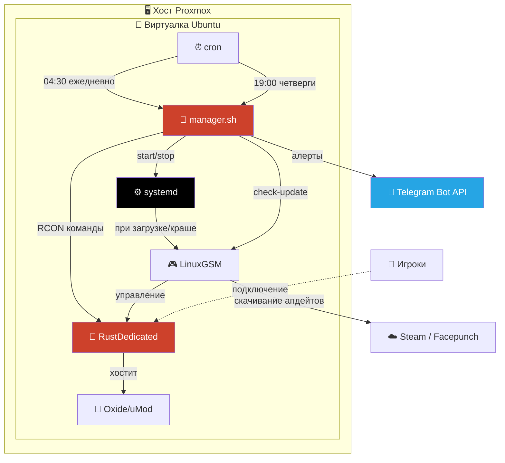
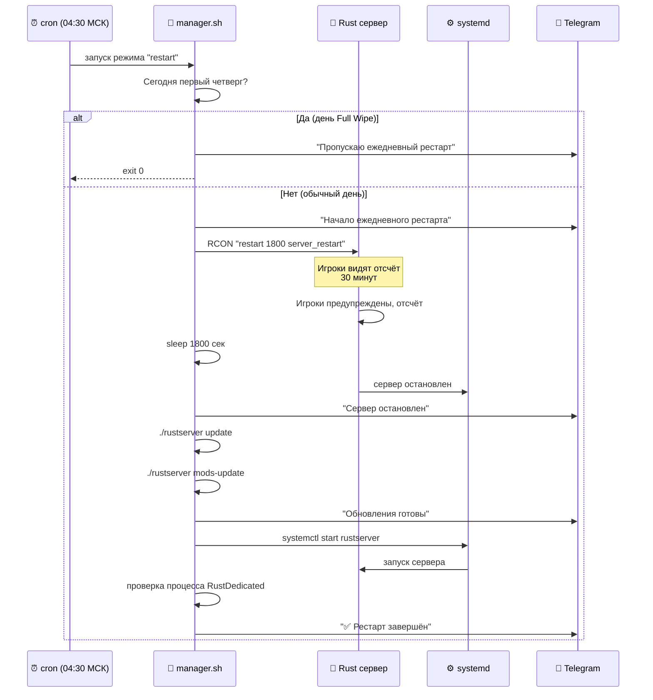
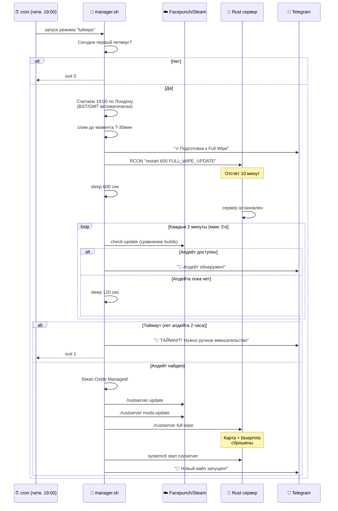

<div align="center">

# 🦀 Rust Wipe Manager

### Готовый к продакшену набор автоматизации для Rust-серверов на LinuxGSM

[](https://opensource.org/licenses/MIT)
[](https://www.gnu.org/software/bash/)
[](https://ubuntu.com/)
[](https://systemd.io/)
[](https://linuxgsm.com/)
[](https://telegram.org/)
[](https://rust.facepunch.com/)

**Ежедневные рестарты • Умный Full Wipe • Детектор обновлений • Telegram-алерты • Самовосстановление**

[🇬🇧 English](README.md) • [Возможности](#-возможности) • [Как работает](#-как-это-работает) • [Установка](#-установка) • [Конфигурация](#%EF%B8%8F-конфигурация) • [Решение проблем](#-решение-проблем)

</div>

---

## 📖 Обзор

**Rust Wipe Manager** — это полный набор автоматизации для серверов [Rust](https://rust.facepunch.com/), работающих на [LinuxGSM](https://linuxgsm.com/). Он берёт на себя всю рутину администрирования Rust-сервера: ежедневные рестарты, ежемесячные Full Wipe, синхронизированные с циклом обновлений Facepunch, восстановление после крашей, обновления ОС и подробные Telegram-уведомления на каждом шаге.

Тулкит написан и проверен в боевых условиях на реальном production-сервере (`bzod.ru`), работающем на **Ubuntu 24.04 LTS** + **Proxmox VM** + **LinuxGSM** + **uMod (Oxide)**.

## ✨ Возможности

### 🔄 Умные ежедневные рестарты
- Предупреждение игроков через RCON с обратным отсчётом (по умолчанию 30 минут)
- Корректное завершение работы с фолбэком на `systemctl stop` если процесс завис
- Автоматическое обновление Rust + Oxide во время рестарта
- Сам пропускает себя в день Full Wipe, чтобы избежать конфликта

### 🔥 Автоматический Full Wipe в первый четверг каждого месяца
- Синхронизируется с официальным расписанием патчей Facepunch (19:00 по Лондону)
- **Ждёт реального появления апдейта в Steam** перед вайпом (риск вайпа на старой версии исключён)
- Опрашивает Steam каждые 2 минуты, до 2 часов
- Прерывает вайп с критическим Telegram-алертом, если апдейт не вышел вовремя
- Бэкапит директорию Oxide `Managed/` перед обновлением

### 🛡️ Интеграция с systemd
- Автозапуск при загрузке машины
- Автоперезапуск при краше (через LGSM monitor)
- Логи доступны через `journalctl -u rustserver`
- Чистый интерфейс `start`/`stop`/`restart`

### 📱 Telegram-уведомления на каждом шаге
- Старт рестарта / RCON отправлен / сервер остановлен / обновления готовы / сервер поднят
- Три уровня логирования: `full` / `success_error` / `error_only`
- Критические алерты при сбоях (таймаут, ошибка обновления, сервер не запустился)

### 🔐 Безопасность
- Все секреты хранятся в отдельном файле `.secrets.env` с правами `chmod 600`
- Sudo ограничен только командами `systemctl` для конкретного сервиса
- Никаких credentials в основном скрипте — безопасно публиковать

## 🏗️ Архитектура



## 🎯 Как это работает

### Сценарий ежедневного рестарта



### Сценарий Full Wipe



## 🛠️ Технологии

| Компонент | Назначение |
|---|---|
|  | Основной язык скриптов |
|  | Хостовая ОС |
|  | Управление сервисами и автозапуск |
|  | Обёртка для игрового сервера |
|  | Сама игра |
|  | Фреймворк плагинов |
|  | Планировщик задач |
|  | RCON-клиент |
|  | Уведомления |

## 📋 Требования

- **ОС**: Ubuntu 24.04 LTS (или любой современный Debian-based дистрибутив с systemd)
- **LinuxGSM** установлен и `rustserver` настроен в `~/rustserver`
- **Rust dedicated server** работает через LGSM
- **systemd** (есть во всех современных дистрибутивах)
- **rcon-cli** от gorcon: [github.com/gorcon/rcon-cli](https://github.com/gorcon/rcon-cli)
- **Telegram-бот** (опционально, но рекомендуется) — токен у [@BotFather](https://t.me/BotFather)
- **sudo** права для пользователя сервера (ограниченные `systemctl`)

## 🚀 Установка

### 1️⃣ Установить LinuxGSM и Rust-сервер

```bash
curl -Lo linuxgsm.sh https://linuxgsm.sh && chmod +x linuxgsm.sh && bash linuxgsm.sh rustserver
./rustserver auto-install
```

### 2️⃣ Установить rcon-cli

```bash
cd ~
wget https://github.com/gorcon/rcon-cli/releases/download/v0.10.3/rcon-0.10.3-amd64_linux.tar.gz
tar -xzf rcon-0.10.3-amd64_linux.tar.gz
rm rcon-0.10.3-amd64_linux.tar.gz
```

### 3️⃣ Настроить systemd-сервис

Создать `/etc/systemd/system/rustserver.service`:

```ini
[Unit]
Description=Rust Server (LinuxGSM)
After=network-online.target
Wants=network-online.target

[Service]
Type=oneshot
RemainAfterExit=yes
User=YOUR_USERNAME
Group=YOUR_USERNAME
WorkingDirectory=/home/YOUR_USERNAME
ExecStart=/home/YOUR_USERNAME/rustserver start
ExecStop=/home/YOUR_USERNAME/rustserver stop
TimeoutStartSec=600
TimeoutStopSec=300

[Install]
WantedBy=multi-user.target
```

Включить и запустить:
```bash
sudo systemctl daemon-reload
sudo systemctl enable rustserver
sudo systemctl start rustserver
```

> ⚠️ **Почему `Type=oneshot`, а не `Type=forking`?** LinuxGSM использует tmux внутри и отделяет процесс. С `Type=forking` systemd теряет связь с реальным процессом сервера. `Type=oneshot` + `RemainAfterExit=yes` — самое чистое решение, которое надёжно работает с LGSM.

### 4️⃣ Настроить sudoers (sudo без пароля)

```bash
echo 'YOUR_USERNAME ALL=(root) NOPASSWD: /usr/bin/systemctl start rustserver, /usr/bin/systemctl stop rustserver, /usr/bin/systemctl restart rustserver' | sudo tee /etc/sudoers.d/YOUR_USERNAME-rustserver
sudo chmod 440 /etc/sudoers.d/YOUR_USERNAME-rustserver
```

### 5️⃣ Скачать репозиторий

```bash
mkdir -p ~/rust_server
cd ~/rust_server
wget https://raw.githubusercontent.com/wobujidao/rust-wipe-manager/main/manager.sh
wget https://raw.githubusercontent.com/wobujidao/rust-wipe-manager/main/config.env.example -O config.env
wget https://raw.githubusercontent.com/wobujidao/rust-wipe-manager/main/secrets.env.example -O .secrets.env
chmod +x manager.sh
chmod 600 .secrets.env
```

### 6️⃣ Настроить секреты и конфиг

Отредактировать `.secrets.env` реальными значениями:
```bash
nano ~/rust_server/.secrets.env
```

```env
TELEGRAM_BOT_TOKEN="123456789:AAAAAAAAAAAAAAAAAAAAAAAAAAAAAAAAAAA"
TELEGRAM_CHAT_ID="-1001234567890"
RCON_PASS="ваш_rcon_пароль"
```

Отредактировать `config.env` под свои пути и предпочтения:
```bash
nano ~/rust_server/config.env
```

### 7️⃣ Протестировать

```bash
~/rust_server/manager.sh test-telegram
~/rust_server/manager.sh check-update
```

Должно прийти сообщение в Telegram и вывестись информация о версиях из Steam.

### 8️⃣ Добавить задачи в cron

```bash
crontab -e
```

Добавить:
```cron
30 4 * * * /home/YOUR_USERNAME/rust_server/manager.sh restart
0 19 * * 4 /home/YOUR_USERNAME/rust_server/manager.sh fullwipe
```

> 💡 Задача Full Wipe запускается **каждый четверг** в 19:00, но скрипт сам проверяет, является ли сегодня первым четвергом месяца, и в обычные четверги сразу выходит.

## ⚙️ Конфигурация

Все настройки находятся в `config.env`. Самые важные:

| Параметр | По умолчанию | Описание |
|---|---|---|
| `DAILY_RESTART_COUNTDOWN` | `1800` | Отсчёт перед ежедневным рестартом (секунд) |
| `DAILY_RESTART_UPDATE_RUST` | `true` | Обновлять Rust при ежедневном рестарте |
| `DAILY_RESTART_UPDATE_OXIDE` | `true` | Обновлять Oxide при ежедневном рестарте |
| `FULLWIPE_COUNTDOWN` | `600` | Отсчёт перед остановкой при Full Wipe (секунд) |
| `FULLWIPE_LONDON_HOUR` | `19` | Час по Лондону, когда Facepunch выпускает апдейты |
| `FULLWIPE_PRE_WAIT_MINUTES` | `30` | За сколько минут до апдейта начать подготовку |
| `FULLWIPE_UPDATE_WAIT_MAX` | `7200` | Макс. время ожидания апдейта Steam (секунд) |
| `FULLWIPE_UPDATE_CHECK_INTERVAL` | `120` | Проверять Steam каждые N секунд |
| `SKIP_DAILY_RESTART_ON_FULLWIPE_DAY` | `true` | Пропускать ежедневный рестарт в день Full Wipe |
| `OXIDE_BACKUP_BEFORE_UPDATE` | `true` | Бэкапить `Managed/` перед обновлением Oxide |
| `SERVER_START_TIMEOUT` | `600` | Макс. время ожидания процесса RustDedicated |
| `ENABLE_TELEGRAM` | `true` | Включить Telegram-уведомления |
| `TELEGRAM_LOG_LEVEL` | `full` | `full` / `success_error` / `error_only` |

## 🎮 Команды

```bash
# Ежедневный рестарт (с авто-пропуском в день Full Wipe)
./manager.sh restart

# Full Wipe (запустится только если сегодня первый четверг)
./manager.sh fullwipe

# Ручной Full Wipe — пропускает проверку даты (ОСТОРОЖНО)
./manager.sh fullwipe-now

# Тест Telegram-уведомлений
./manager.sh test-telegram

# Проверить наличие апдейта Rust в Steam
./manager.sh check-update
```

## 📁 Структура проекта

```
rust_server/
├── manager.sh           # Главный скрипт
├── config.env           # Конфигурация (пути, тайминги, флаги)
├── .secrets.env         # Telegram токен, RCON пароль (chmod 600)
└── logs/
    └── manager-YYYYMMDD.log
```

## 🔧 Решение проблем

### Сервер не поднимается автоматически после ребута
Проверь systemd-юнит:
```bash
sudo systemctl status rustserver
sudo systemctl is-enabled rustserver
journalctl -u rustserver -n 50
```
Убедись, что он `enabled` и используется `Type=oneshot` (а не `forking`).

### `sudo: a password is required` из cron
Правило `sudoers.d/` не применилось корректно. Проверь:
```bash
sudo -n systemctl status rustserver
```
Должно показать статус без запроса пароля.

### Full Wipe запустился, но сервер на старой версии
Цикл `wait_for_rust_update` должен это предотвратить. Если всё-таки случилось:
1. Посмотри `~/rust_server/logs/manager-*.log` на этапе ожидания
2. Проверь вручную, что `check-update` корректно возвращает номера build
3. Увеличь `FULLWIPE_UPDATE_WAIT_MAX`, если Facepunch особо опаздывает

### Oxide не загружается после Full Wipe
Релизы Oxide иногда задерживаются на 30-90 минут после релизов Rust. Если `mods-update` отработал слишком рано — может быть скачана несовместимая версия. Решения:
- Подожди 30 минут и запусти `~/rustserver mods-update` вручную, потом перезапусти сервер
- Восстанови из автобэкапа: `~/serverfiles/RustDedicated_Data/Managed.backup-YYYY-MM-DD/`

### Сообщения Telegram не приходят
```bash
~/rust_server/manager.sh test-telegram
```
Если ничего не приходит, проверь:
- Корректный токен бота в `.secrets.env`
- Корректный chat ID (отрицательный для групп, положительный для личных чатов)
- Бот добавлен в группу/канал
- `curl https://api.telegram.org/botYOUR_TOKEN/getMe` возвращает `"ok":true`

## 🗺️ Планы развития

- [ ] Поддержка Discord webhook (вместе с Telegram)
- [ ] Веб-дашборд для просмотра логов
- [ ] Автоматическая ротация сидов карт
- [ ] Интеграция с `BattleMetrics` API для алертов по онлайну
- [ ] Уведомления об апдейтах популярных плагинов
- [ ] Поддержка нескольких серверов (один менеджер, много серверов)

## 🤝 Вклад в проект

PR и issue приветствуются. Этот проект сделан для реальной боевой эксплуатации, поэтому, пожалуйста, тестируй изменения на реальном LGSM Rust-сервере перед PR.

## 📜 Лицензия

MIT — делай с этим кодом что хочешь, только не вини меня, если твой сервер взорвётся.

## 🙏 Благодарности

- [LinuxGSM](https://linuxgsm.com/) — невоспетый герой хостинга игровых серверов
- [gorcon/rcon-cli](https://github.com/gorcon/rcon-cli) — чистый RCON-клиент
- [Facepunch Studios](https://facepunch.com/) — за создание Rust
- [uMod / Oxide](https://umod.org/) — за экосистему плагинов

---

<div align="center">

Если это сэкономило тебе время — поставь ⭐ репозиторию!

</div>
