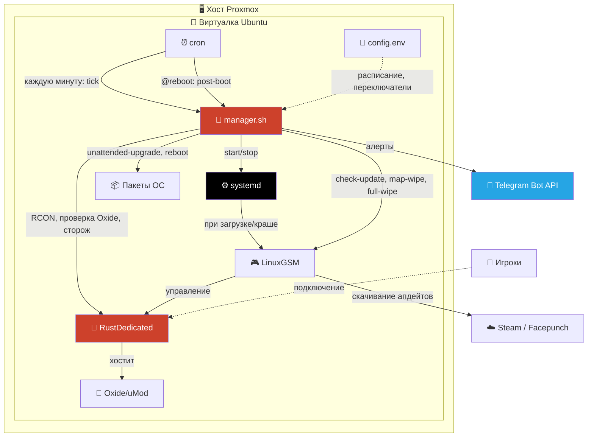
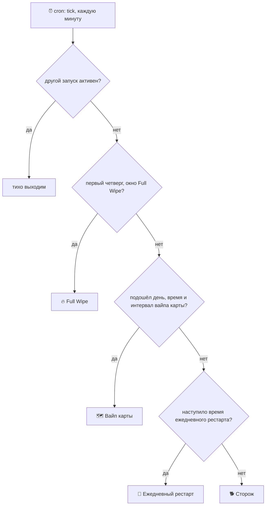
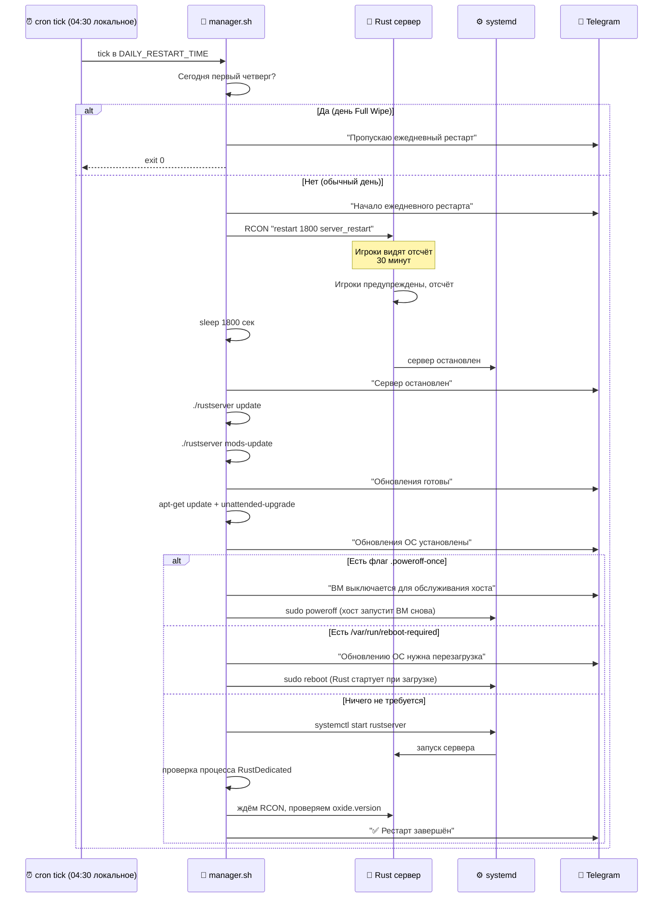
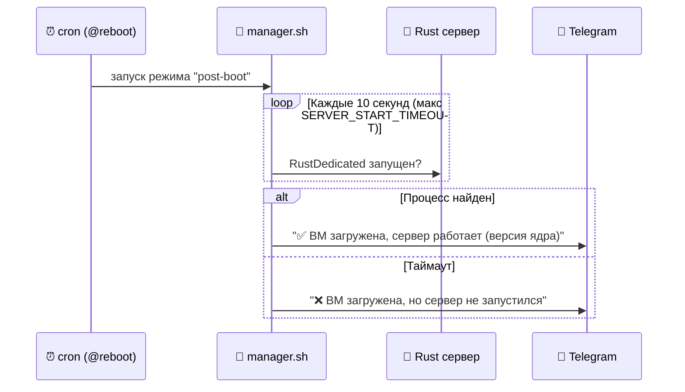
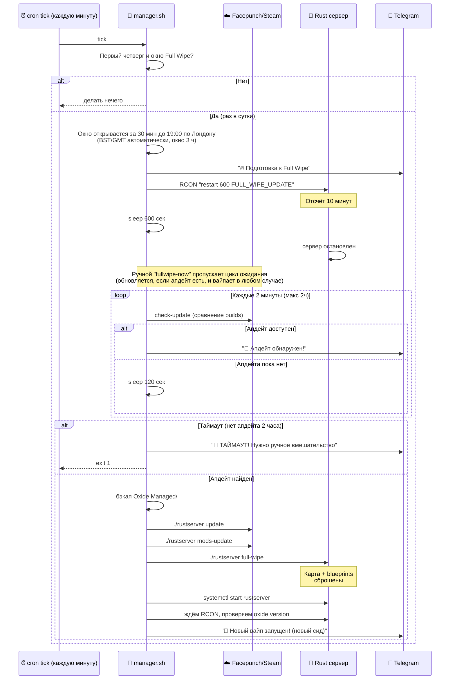
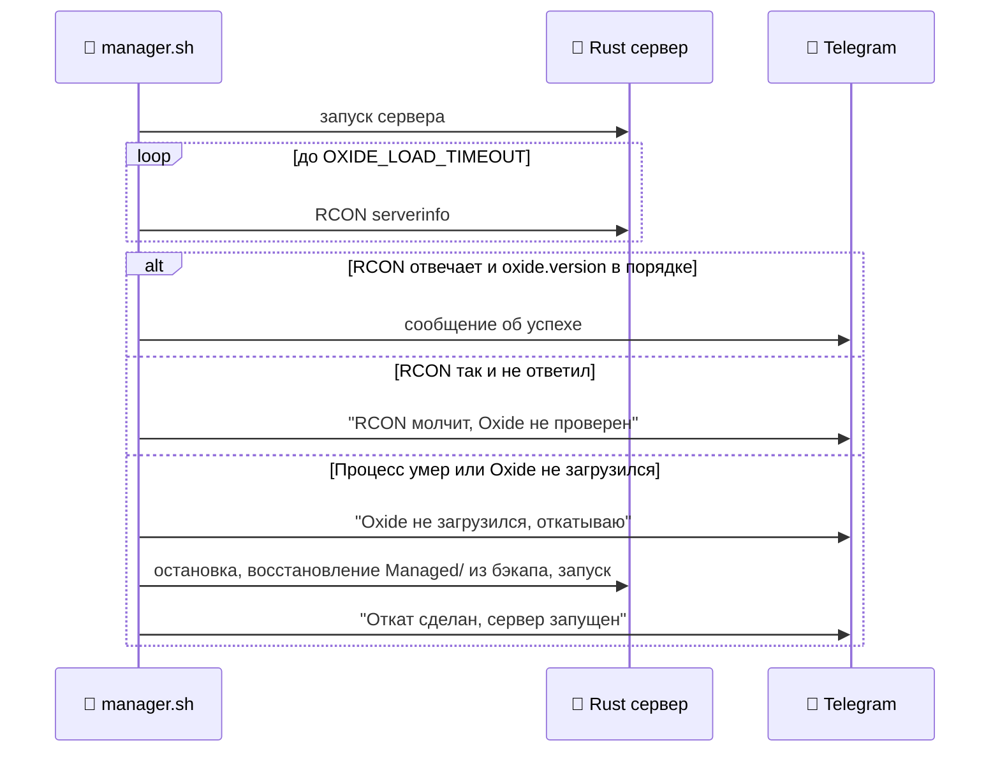
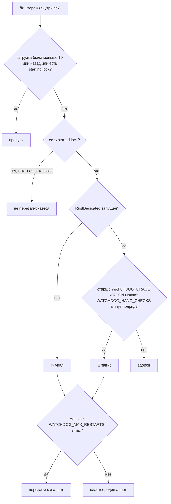

<div align="center">

# 🦀 Rust Wipe Manager

### Готовый к продакшену набор автоматизации для Rust-серверов на LinuxGSM

[](https://opensource.org/licenses/MIT)
[](https://www.gnu.org/software/bash/)
[](https://ubuntu.com/)
[](https://systemd.io/)
[](https://linuxgsm.com/)
[](https://telegram.org/)
[](https://rust.facepunch.com/)

**Ежедневные рестарты • Умный Full Wipe • Необязательные вайпы карты • Сторож • Детектор обновлений • Telegram-алерты • Самовосстановление**

[🇬🇧 English](README.md) • [Возможности](#-возможности) • [Как работает](#-как-это-работает) • [Установка](#-установка) • [Конфигурация](#%EF%B8%8F-конфигурация) • [Решение проблем](#-решение-проблем)

</div>

---

## 📖 Обзор

**Rust Wipe Manager** — это полный набор автоматизации для серверов [Rust](https://rust.facepunch.com/), работающих на [LinuxGSM](https://linuxgsm.com/). Он берёт на себя всю рутину администрирования Rust-сервера: ежедневные рестарты, ежемесячные Full Wipe, синхронизированные с циклом обновлений Facepunch, восстановление после крашей, обновления ОС и подробные Telegram-уведомления на каждом шаге.

Тулкит написан и проверен в боевых условиях на реальном production-сервере (`bzod.ru`), работающем на **Ubuntu 24.04 LTS** + **Proxmox VM** + **LinuxGSM** + **uMod (Oxide)**.

## ✨ Возможности

### 🔄 Умные ежедневные рестарты
- Запускается в `DAILY_RESTART_TIME` (по умолчанию 04:30 по времени ВМ) — отдельная строка в cron не нужна
- Предупреждение игроков через RCON с обратным отсчётом (по умолчанию 30 минут)
- Корректное завершение работы с фолбэком на `systemctl stop` если процесс завис
- Автоматическое обновление Rust + Oxide во время рестарта
- Обновление пакетов ОС (`unattended-upgrade`) в том же окне, пока сервер остановлен
- Перезагружает ВМ вместо запуска сервера, если этого требует ОС (systemd-юнит поднимает Rust при загрузке)
- Одноразовый флаг выключения (`.poweroff-once`) для обслуживания на стороне хоста
- Проверка Oxide после каждого запуска с автоматическим откатом, если Oxide не загрузился
- Сам пропускает себя в день Full Wipe, чтобы избежать конфликта

### 🔥 Автоматический Full Wipe в первый четверг каждого месяца
- Синхронизируется с официальным расписанием патчей Facepunch (19:00 по Лондону)
- Стартует сам в момент (лондонский час − время подготовки) в рамках трёхчасового окна
- **Ждёт реального появления апдейта в Steam** перед вайпом (риск вайпа на старой версии исключён)
- Опрашивает Steam каждые 2 минуты, до 2 часов
- Прерывает вайп с критическим Telegram-алертом, если апдейт не вышел вовремя
- Ручной `fullwipe-now` **не ждёт**: обновляется, если апдейт есть, и вайпает в любом случае
- Новый случайный сид карты при каждом Full Wipe (это делает LinuxGSM, если `seed` пустой, см. [Сид карты](#-сид-карты))
- Бэкапит директорию Oxide `Managed/` перед обновлением

### 🗺️ Необязательные вайпы карты между месячными Full Wipe
- Раз в неделю, раз в две недели и т. д. в выбранный день и время (`MAPWIPE_*`), по умолчанию выключены
- Используют LGSM `map-wipe`: только карта, чертежи остаются, новый случайный сид
- Никогда не ждут апдейт Facepunch; интервал считается от последнего вайпа любого вида, поэтому совпадает с принудительным месячным
- В день Full Wipe пропускаются

### 🗓️ Одна строка cron, расписание в `config.env`
- `* * * * * manager.sh tick` каждую минуту читает `config.env` и запускает то, что подошло по времени: ежедневный рестарт, Full Wipe, вайп карты — иначе сторожа
- Время, дни и интервалы меняются в `config.env`, cron трогать не нужно
- Каждое событие срабатывает раз в сутки в пределах окна; ВМ, которая была выключена в это время, пропускает событие, а не запускает его на несколько часов позже
- Одновременно работает только один запуск (`flock`): второй ручной запуск отменяется с алертом в Telegram

### 🐕 Сторож (watchdog)
- Перезапускает упавший сервер и зависший (процесс жив, но RCON молчит несколько минут подряд)
- Уважает штатную остановку (`./rustserver stop`, `systemctl stop rustserver`) и никогда её не перезапускает
- Сдаётся и один раз шлёт алерт, если сервер продолжает падать (`WATCHDOG_MAX_RESTARTS` в час)

### 🧩 Страховка для Oxide
- После каждого запуска (ежедневный рестарт и вайпы) ждёт RCON и проверяет `oxide.version`
- Если Oxide не загрузился или сервер умер во время загрузки: остановка, восстановление `Managed/` из бэкапа, сделанного перед обновлением Oxide в этом запуске, новый старт, алерт

### 🛡️ Интеграция с systemd
- Автозапуск при загрузке машины
- Восстановление после краша и зависания встроенным сторожем (см. выше)
- Логи доступны через `journalctl -u rustserver`
- Чистый интерфейс `start`/`stop`/`restart`

### 📱 Telegram-уведомления на каждом шаге
- Старт рестарта / RCON отправлен / сервер остановлен / обновления готовы / сервер поднят
- После любой загрузки ВМ: сервер поднялся (с версией ядра) или не запустился (`post-boot`)
- Три уровня логирования: `full` / `success_error` / `error_only`
- Сообщения на английском или русском (`MESSAGES_LANG=en|ru`)
- Отправляются как URL-кодированный обычный текст (без причуд Markdown: `+` и `_` доходят как есть)
- Сообщение «новый вайп запущен» содержит новый сид карты
- Критические алерты при сбоях (таймаут, ошибка обновления, сервер не запустился, откат Oxide, сторож сдался)

### 🔐 Безопасность
- Все секреты хранятся в отдельном файле `.secrets.env` с правами `chmod 600`
- Sudo ограничен коротким списком команд: `systemctl` для сервиса, `apt-get update -qq`, `unattended-upgrade`, `reboot`, `poweroff`
- Никаких credentials в основном скрипте — безопасно публиковать

## 🏗️ Архитектура


```mermaid
graph TB
    subgraph "🖥️ Хост Proxmox"
        subgraph "🐧 Виртуалка Ubuntu"
            CRON[⏰ cron]
            SYSTEMD[⚙️ systemd]
            MANAGER[📜 manager.sh]
            LGSM[🎮 LinuxGSM]
            RUST[🦀 RustDedicated]
            OXIDE[🔧 Oxide/uMod]
            OS[📦 Пакеты ОС]
            CONF[📄 config.env]
        end
    end

    TG[📱 Telegram Bot API]
    STEAM[☁️ Steam / Facepunch]
    PLAYERS[👥 Игроки]

    CRON -->|"каждую минуту: tick"| MANAGER
    CRON -->|"@reboot: post-boot"| MANAGER
    CONF -.->|"расписание, переключатели"| MANAGER
    SYSTEMD -->|"при загрузке/краше"| LGSM
    MANAGER -->|"start/stop"| SYSTEMD
    MANAGER -->|"RCON, проверка Oxide, сторож"| RUST
    MANAGER -->|"check-update, map-wipe, full-wipe"| LGSM
    MANAGER -->|"unattended-upgrade, reboot"| OS
    MANAGER -->|"алерты"| TG
    LGSM -->|"скачивание апдейтов"| STEAM
    LGSM -->|"управление"| RUST
    RUST -->|"хостит"| OXIDE
    PLAYERS -.->|"подключение"| RUST

    style MANAGER fill:#CD412B,color:#fff
    style RUST fill:#CD412B,color:#fff
    style TG fill:#26A5E4,color:#fff
    style SYSTEMD fill:#000,color:#fff
```

## 🎯 Как это работает

### Планировщик (`tick`)


```mermaid
graph TD
    TICK["⏰ cron: tick, каждую минуту"] --> LOCK{"другой запуск активен?"}
    LOCK -->|"да"| EXIT["тихо выходим"]
    LOCK -->|"нет"| FW{"первый четверг, окно Full Wipe?"}
    FW -->|"да"| FWRUN["🔥 Full Wipe"]
    FW -->|"нет"| MW{"подошёл день, время и интервал вайпа карты?"}
    MW -->|"да"| MWRUN["🗺️ Вайп карты"]
    MW -->|"нет"| DR{"наступило время ежедневного рестарта?"}
    DR -->|"да"| DRRUN["🔄 Ежедневный рестарт"]
    DR -->|"нет"| WD["🐕 Сторож"]
```

`tick` перечитывает `config.env` при каждом запуске. Время — локальное время ВМ.

- **Ежедневный рестарт** — в `DAILY_RESTART_TIME`.
- **Full Wipe** — первый четверг, начиная с (`FULLWIPE_LONDON_HOUR` по Лондону − `FULLWIPE_PRE_WAIT_MINUTES`), в пределах трёхчасового окна.
- **Вайп карты** — в день `MAPWIPE_DAY` (1=пн … 7=вс) в `MAPWIPE_TIME`, раз в `MAPWIPE_INTERVAL_WEEKS`, считая от последнего вайпа любого вида (время изменения самого свежего файла `*.map`), и только в дни месяца `MAPWIPE_MONTH_DAYS`, если они заданы. В день Full Wipe пропускается.
- **Раз в сутки в пределах окна** — каждое событие срабатывает раз в сутки в пределах окна (1 час для рестарта и вайпа карты, 3 часа для Full Wipe). ВМ, выключенная в это время, пропускает событие, а не запускает его на несколько часов позже. Отметки «выполнено» лежат в `.state/done-*`.
- **Иначе** — `tick` запускает сторожа.
- **Старые команды** — `restart` сразу выполняет ежедневный рестарт; `fullwipe` — прежняя запись для cron (Full Wipe только в первый четверг).

### Сценарий ежедневного рестарта


```mermaid
sequenceDiagram
    participant C as ⏰ cron tick (04:30 локальное)
    participant M as 📜 manager.sh
    participant R as 🦀 Rust сервер
    participant S as ⚙️ systemd
    participant T as 📱 Telegram

    C->>M: tick в DAILY_RESTART_TIME
    M->>M: Сегодня первый четверг?
    alt Да (день Full Wipe)
        M->>T: "Пропускаю ежедневный рестарт"
        M-->>C: exit 0
    else Нет (обычный день)
        M->>T: "Начало ежедневного рестарта"
        M->>R: RCON "restart 1800 server_restart"
        Note over R: Игроки видят отсчёт<br/>30 минут
        R->>R: Игроки предупреждены, отсчёт
        M->>M: sleep 1800 сек
        R->>S: сервер остановлен
        M->>T: "Сервер остановлен"
        M->>M: ./rustserver update
        M->>M: ./rustserver mods-update
        M->>T: "Обновления готовы"
        M->>M: apt-get update + unattended-upgrade
        M->>T: "Обновления ОС установлены"
        alt Есть флаг .poweroff-once
            M->>T: "ВМ выключается для обслуживания хоста"
            M->>S: sudo poweroff (хост запустит ВМ снова)
        else Есть /var/run/reboot-required
            M->>T: "Обновлению ОС нужна перезагрузка"
            M->>S: sudo reboot (Rust стартует при загрузке)
        else Ничего не требуется
            M->>S: systemctl start rustserver
            S->>R: запуск сервера
            M->>M: проверка процесса RustDedicated
            M->>R: ждём RCON, проверяем oxide.version
            M->>T: "✅ Рестарт завершён"
        end
    end
```

Шаги обслуживания ОС (`update_system`, `reboot_if_required`) выполняются после обновления Rust/Oxide, пока сервер остановлен:

- **Обновления ОС** — `apt-get update -qq` + `unattended-upgrade`, включаются параметром `SYSTEM_UPDATE_ENABLED`. Что именно ставится — настройка самой Ubuntu (`Unattended-Upgrade::Allowed-Origins` в `/etc/apt/apt.conf.d/50unattended-upgrades`; по умолчанию обновления безопасности), а это окно определяет только *когда*. Чтобы обновления ставились только здесь, отключи штатный таймер apt (см. «Установка», шаг 4). Лог: `/var/log/unattended-upgrades/unattended-upgrades.log`.
- **Перезагрузка** — параметр `REBOOT_IF_REQUIRED`. Если есть `/var/run/reboot-required`, ВМ перезагружается вместо запуска сервера; systemd-юнит поднимает Rust при загрузке.
- **Одноразовое выключение** — `touch ~/rust_server/.poweroff-once`: при ближайшем ежедневном рестарте ВМ выключится вместо запуска сервера (для обслуживания на стороне хоста, например `qm enroll-efi-keys <vmid>` в Proxmox, которому нужна выключенная ВМ). Флаг удаляется при использовании, а запустить ВМ снова должен хост.

### Отчёт после загрузки


```mermaid
sequenceDiagram
    participant C as ⏰ cron (@reboot)
    participant M as 📜 manager.sh
    participant R as 🦀 Rust сервер
    participant T as 📱 Telegram

    C->>M: запуск режима "post-boot"
    loop Каждые 10 секунд (макс SERVER_START_TIMEOUT)
        M->>R: RustDedicated запущен?
    end
    alt Процесс найден
        M->>T: "✅ ВМ загружена, сервер работает (версия ядра)"
    else Таймаут
        M->>T: "❌ ВМ загружена, но сервер не запустился"
    end
```

### Сценарий Full Wipe


```mermaid
sequenceDiagram
    participant C as ⏰ cron tick (каждую минуту)
    participant M as 📜 manager.sh
    participant FP as ☁️ Facepunch/Steam
    participant R as 🦀 Rust сервер
    participant T as 📱 Telegram

    C->>M: tick
    M->>M: Первый четверг и окно Full Wipe?
    alt Нет
        M-->>C: делать нечего
    else Да (раз в сутки)
        M->>M: Окно открывается за 30 мин до 19:00 по Лондону<br/>(BST/GMT автоматически, окно 3 ч)
        M->>T: "🔥 Подготовка к Full Wipe"
        M->>R: RCON "restart 600 FULL_WIPE_UPDATE"
        Note over R: Отсчёт 10 минут
        M->>M: sleep 600 сек
        R->>R: сервер остановлен

        Note over M,FP: Ручной "fullwipe-now" пропускает цикл ожидания<br/>(обновляется, если апдейт есть, и вайпает в любом случае)
        loop Каждые 2 минуты (макс 2ч)
            M->>FP: check-update (сравнение builds)
            alt Апдейт доступен
                M->>T: "🎉 Апдейт обнаружен!"
            else Апдейта пока нет
                M->>M: sleep 120 сек
            end
        end

        alt Таймаут (нет апдейта 2 часа)
            M->>T: "🚨 ТАЙМАУТ! Нужно ручное вмешательство"
            M-->>C: exit 1
        else Апдейт найден
            M->>M: бэкап Oxide Managed/
            M->>FP: ./rustserver update
            M->>FP: ./rustserver mods-update
            M->>R: ./rustserver full-wipe
            Note over R: Карта + blueprints<br/>сброшены
            M->>R: systemctl start rustserver
            M->>R: ждём RCON, проверяем oxide.version
            M->>T: "🎉 Новый вайп запущен! (новый сид)"
        end
    end
```

> 💡 Цикл ожидания относится к плановому Full Wipe (первый четверг). Ручной `fullwipe-now` и вайпы карты не ждут Facepunch: они выполняют `./rustserver update` (тот обновляет, только если вышла новая сборка) и затем вайпают в любом случае.

### Вайп карты

Включается через `MAPWIPE_ENABLED="true"`. В день `MAPWIPE_DAY` в `MAPWIPE_TIME` начинается отсчёт (`FULLWIPE_COUNTDOWN`), сервер останавливается, Rust и Oxide обновляются, если вышли апдейты, затем запускается LGSM `map-wipe` (чертежи остаются, новый случайный сид, как и у `full-wipe`), сервер стартует, выполняется проверка Oxide и приходит сообщение «новый вайп запущен» с сидом. Апдейта Facepunch он никогда не ждёт. Запустить вручную: `./manager.sh mapwipe-now`.

### Проверка Oxide после каждого запуска


```mermaid
sequenceDiagram
    participant M as 📜 manager.sh
    participant R as 🦀 Rust сервер
    participant T as 📱 Telegram

    M->>R: запуск сервера
    loop до OXIDE_LOAD_TIMEOUT
        M->>R: RCON serverinfo
    end
    alt RCON отвечает и oxide.version в порядке
        M->>T: сообщение об успехе
    else RCON так и не ответил
        M->>T: "RCON молчит, Oxide не проверен"
    else Процесс умер или Oxide не загрузился
        M->>T: "Oxide не загрузился, откатываю"
        M->>R: остановка, восстановление Managed/ из бэкапа, запуск
        M->>T: "Откат сделан, сервер запущен"
    end
```

- Управляется `OXIDE_CHECK_ENABLED`. Бэкап — это копия `Managed.backup-<дата>`, сделанная прямо перед обновлением Oxide в этом запуске, поэтому если Oxide в запуске не обновлялся, откатываться не к чему (придёт алерт).
- ⚠️ Если в том же запуске обновился сам Rust, эта копия «чистая» (без Oxide): сервер будет работать без плагинов, пока uMod не выпустит исправление.
- `OXIDE_LOAD_TIMEOUT` должен покрывать генерацию карты после вайпа — на слабом железе она может занимать больше 10 минут.

### Сторож (watchdog)


```mermaid
graph TD
    W["🐕 Сторож (внутри tick)"] --> B{"загрузка была меньше 10 мин назад или есть starting.lock?"}
    B -->|"да"| SKIP["пропуск"]
    B -->|"нет"| L{"есть started.lock?"}
    L -->|"нет, штатная остановка"| NEVER["не перезапускается"]
    L -->|"да"| P{"RustDedicated запущен?"}
    P -->|"нет"| CR["💥 упал"]
    P -->|"да"| H{"старше WATCHDOG_GRACE и RCON молчит WATCHDOG_HANG_CHECKS минут подряд?"}
    H -->|"да"| HU["🧊 завис"]
    H -->|"нет"| OK["здоров"]
    CR --> LIM{"меньше WATCHDOG_MAX_RESTARTS в час?"}
    HU --> LIM
    LIM -->|"да"| RS["перезапуск и алерт"]
    LIM -->|"нет"| GU["сдаётся, один алерт"]
```

- Работает внутри `tick` каждую минуту (или вручную: `./manager.sh watchdog`).
- **Упавший** сервер — это отсутствие процесса `RustDedicated` при наличии `lgsm/lock/rustserver-started.lock` у LGSM. **Зависший** — процесс старше `WATCHDOG_GRACE`, у которого RCON `serverinfo` молчит `WATCHDOG_HANG_CHECKS` минут подряд.
- Штатная остановка (`./rustserver stop` или `systemctl stop rustserver`) удаляет `started.lock`, поэтому сервер не перезапускается. Команда `quit` из консоли или RCON оставляет файл, и сторож перезапускает сервер — см. «Решение проблем».
- Он пропускает первые 10 минут после загрузки (этим занимается `post-boot`) и всё время, пока у LGSM есть `starting.lock`.
- После `WATCHDOG_MAX_RESTARTS` перезапусков за час он сдаётся и шлёт один алерт; `.state/gave_up` очищается, когда сервер снова здоров.

### Один запуск за раз и логи

- `manager.sh` берёт `flock` на `.manager.lock`. Второй ручной или cron-запуск отменяется с алертом в Telegram; `tick` и `watchdog` при занятом замке молча выходят. LGSM и rcon запускаются с закрытым файловым дескриптором 9, поэтому замок не «утекает» в tmux.
- Файлы `manager-*.log` старше `LOG_KEEP_DAYS` удаляются; `cron.log` при достижении 10 МБ переименовывается в `cron.log.1`.

## 🛠️ Технологии

| Компонент | Назначение |
|---|---|
|  | Основной язык скриптов |
|  | Хостовая ОС |
|  | Управление сервисами и автозапуск |
|  | Обёртка для игрового сервера |
|  | Сама игра |
|  | Фреймворк плагинов |
|  | Планировщик задач |
|  | RCON-клиент |
|  | Уведомления |

## 📋 Требования

- **ОС**: Ubuntu 24.04 LTS (или любой современный Debian-based дистрибутив с systemd)
- **LinuxGSM** установлен и `rustserver` настроен в `~/rustserver`
- **Rust dedicated server** работает через LGSM
- **systemd** (есть во всех современных дистрибутивах)
- **rcon-cli** от gorcon: [github.com/gorcon/rcon-cli](https://github.com/gorcon/rcon-cli)
- **Telegram-бот** (опционально, но рекомендуется) — токен у [@BotFather](https://t.me/BotFather)
- **sudo** права для пользователя сервера (ограниченные `systemctl`, `apt-get update -qq`, `unattended-upgrade`, `reboot`, `poweroff`)

## 🚀 Установка

### 1️⃣ Установить LinuxGSM и Rust-сервер

```bash
curl -Lo linuxgsm.sh https://linuxgsm.sh && chmod +x linuxgsm.sh && bash linuxgsm.sh rustserver
./rustserver auto-install
```

### 2️⃣ Установить rcon-cli

```bash
cd ~
wget https://github.com/gorcon/rcon-cli/releases/download/v0.10.3/rcon-0.10.3-amd64_linux.tar.gz
tar -xzf rcon-0.10.3-amd64_linux.tar.gz
rm rcon-0.10.3-amd64_linux.tar.gz
```

### 3️⃣ Настроить systemd-сервис

Создать `/etc/systemd/system/rustserver.service`:

```ini
[Unit]
Description=Rust Server (LinuxGSM)
After=network-online.target
Wants=network-online.target

[Service]
Type=oneshot
RemainAfterExit=yes
User=YOUR_USERNAME
Group=YOUR_USERNAME
WorkingDirectory=/home/YOUR_USERNAME
ExecStart=/home/YOUR_USERNAME/rustserver start
ExecStop=/home/YOUR_USERNAME/rustserver stop
TimeoutStartSec=600
TimeoutStopSec=300

[Install]
WantedBy=multi-user.target
```

Включить и запустить:
```bash
sudo systemctl daemon-reload
sudo systemctl enable rustserver
sudo systemctl start rustserver
```

> ⚠️ **Почему `Type=oneshot`, а не `Type=forking`?** LinuxGSM использует tmux внутри и отделяет процесс. С `Type=forking` systemd теряет связь с реальным процессом сервера. `Type=oneshot` + `RemainAfterExit=yes` — самое чистое решение, которое надёжно работает с LGSM.

### 4️⃣ Настроить sudoers (sudo без пароля для systemctl, apt, reboot)

```bash
echo 'YOUR_USERNAME ALL=(root) NOPASSWD: /usr/bin/systemctl start rustserver, /usr/bin/systemctl stop rustserver, /usr/bin/systemctl restart rustserver, /usr/bin/apt-get update -qq, /usr/bin/unattended-upgrade, /usr/sbin/reboot, /usr/sbin/poweroff' | sudo tee /etc/sudoers.d/YOUR_USERNAME-rustserver
sudo chmod 440 /etc/sudoers.d/YOUR_USERNAME-rustserver
```

**Рекомендуется:** отключить штатный таймер unattended-upgrade, чтобы обновления ОС ставились только в окне ежедневного рестарта, пока сервер остановлен. В `/etc/apt/apt.conf.d/20auto-upgrades` оставь обновление списка пакетов и выключи периодическую установку:

```
APT::Periodic::Update-Package-Lists "1";
APT::Periodic::Unattended-Upgrade "0";
```

### 5️⃣ Скачать репозиторий

```bash
mkdir -p ~/rust_server
cd ~/rust_server
wget https://raw.githubusercontent.com/wobujidao/rust-wipe-manager/main/manager.sh
wget https://raw.githubusercontent.com/wobujidao/rust-wipe-manager/main/config.env.example -O config.env
wget https://raw.githubusercontent.com/wobujidao/rust-wipe-manager/main/secrets.env.example -O .secrets.env
chmod +x manager.sh
chmod 600 .secrets.env
```

### 6️⃣ Настроить секреты и конфиг

Отредактировать `.secrets.env` реальными значениями:
```bash
nano ~/rust_server/.secrets.env
```

```env
TELEGRAM_BOT_TOKEN="123456789:AAAAAAAAAAAAAAAAAAAAAAAAAAAAAAAAAAA"
TELEGRAM_CHAT_ID="-1001234567890"
RCON_PASS="ваш_rcon_пароль"
```

Отредактировать `config.env` под свои пути и предпочтения:
```bash
nano ~/rust_server/config.env
```

### 7️⃣ Протестировать

```bash
~/rust_server/manager.sh test-telegram
~/rust_server/manager.sh check-update
```

Должно прийти сообщение в Telegram и вывестись информация о версиях из Steam.

### 8️⃣ Добавить задачи в cron

```bash
crontab -e
```

Добавить:
```cron
* * * * * /home/YOUR_USERNAME/rust_server/manager.sh tick >> /home/YOUR_USERNAME/rust_server/logs/cron.log 2>&1
@reboot /home/YOUR_USERNAME/rust_server/manager.sh post-boot >> /home/YOUR_USERNAME/rust_server/logs/cron.log 2>&1
```

> 💡 `tick` запускается каждую минуту, читает `config.env` и запускает то, что подошло по времени: ежедневный рестарт в `DAILY_RESTART_TIME`, Full Wipe в первый четверг начиная с (`FULLWIPE_LONDON_HOUR` по Лондону − `FULLWIPE_PRE_WAIT_MINUTES`), необязательный вайп карты. Если ничего не подошло, запускается сторож. Подробности — в разделе [Планировщик](#планировщик-tick).

> 🕒 Всё время — по **локальному часовому поясу ВМ**. Событие, пропущенное из-за выключенной ВМ, не запускается с опозданием на несколько часов, а пропускается.

> 📣 Запись `@reboot` запускает `post-boot` после каждой загрузки ВМ (включая перезагрузки и включения после ежедневного рестарта) и сообщает в Telegram, поднялся ли сервер.

#### Переход со старых строк cron

Старые версии использовали по строке cron на каждую задачу (`... manager.sh restart` в 04:30 и `... manager.sh fullwipe` по четвергам в 19:00). Удали обе и добавь строку `tick` выше, иначе два запуска стартуют одновременно, и замок отменит один из них с алертом в Telegram. Затем:

- Перенеси новые параметры из `config.env.example` в свой `config.env`. Старый `config.env` продолжит работать: недостающие параметры получают значения по умолчанию (ежедневный рестарт в 04:30, вайп карты выключен, обновления ОС и перезагрузка выключены, проверка Oxide и сторож включены).
- Если в твоём `config.env` всё ещё `OXIDE_LOAD_TIMEOUT=300`, увеличь значение (новое по умолчанию — `900`), чтобы оно покрывало генерацию карты после вайпа.
- `fullwipe` по-прежнему работает как устаревшая команда (только первый четверг), а `restart` по-прежнему сразу выполняет ежедневный рестарт.

## ⚙️ Конфигурация

Все настройки находятся в `config.env`. [`config.env.example`](config.env.example) описывает каждый параметр прямо в файле — комментарий стоит над каждой строкой. Самые важные:

| Параметр | По умолчанию | Описание |
|---|---|---|
| `DAILY_RESTART_ENABLED` | `true` | Включить ежедневный рестарт |
| `DAILY_RESTART_TIME` | `04:30` | Время ежедневного рестарта (по времени ВМ) |
| `DAILY_RESTART_COUNTDOWN` | `1800` | Отсчёт перед ежедневным рестартом (секунд) |
| `DAILY_RESTART_UPDATE_RUST` | `true` | Обновлять Rust при ежедневном рестарте |
| `DAILY_RESTART_UPDATE_OXIDE` | `true` | Обновлять Oxide при ежедневном рестарте |
| `FULLWIPE_ENABLED` | `true` | Включить Full Wipe |
| `FULLWIPE_COUNTDOWN` | `600` | Отсчёт перед остановкой при Full Wipe / вайпе карты (секунд) |
| `FULLWIPE_LONDON_HOUR` | `19` | Час по Лондону, когда Facepunch выпускает апдейты |
| `FULLWIPE_PRE_WAIT_MINUTES` | `30` | За сколько минут до апдейта начать подготовку |
| `FULLWIPE_UPDATE_WAIT_MAX` | `7200` | Макс. время, которое плановый Full Wipe ждёт апдейт Steam (секунд); `fullwipe-now` и вайпы карты не ждут |
| `FULLWIPE_UPDATE_CHECK_INTERVAL` | `120` | Проверять Steam каждые N секунд |
| `MAPWIPE_ENABLED` | `false` | Включить плановые вайпы карты (только карта, чертежи остаются) |
| `MAPWIPE_DAY` | `5` | День недели: 1=пн … 7=вс |
| `MAPWIPE_TIME` | `19:00` | Время старта (по времени ВМ); в этот момент начинается отсчёт |
| `MAPWIPE_INTERVAL_WEEKS` | `1` | 1 = каждую неделю, 2 = раз в две недели и т. д.; считается от последнего вайпа любого вида |
| `MAPWIPE_MONTH_DAYS` | `""` | Дни месяца, `С-ПО` (например `16-22`); пусто = любой день |
| `MAPWIPE_OPEN_TIME` | `""` | После вайпа карты держать игроков в очереди подключения (maxplayers 0) до ЧЧ:ММ; пусто = открыть сразу |
| `FULLWIPE_OPEN_TIME` | `""` | То же для полного вайпа |
| `WIPETIMER_ENABLED` | `false` | Показывать в браузере серверов следующий вайп по этому расписанию (`wipetimer.wipeunixtimestampoverride`) |
| `SKIP_DAILY_RESTART_ON_FULLWIPE_DAY` | `true` | Пропускать ежедневный рестарт в день Full Wipe |
| `OXIDE_BACKUP_BEFORE_UPDATE` | `true` | Бэкапить `Managed/` перед обновлением Oxide |
| `OXIDE_CHECK_ENABLED` | `true` | После запуска проверить `oxide.version`, при поломке Oxide откатить `Managed/` |
| `OXIDE_LOAD_TIMEOUT` | `900` | Макс. ожидание RCON после запуска (секунд); должно покрывать генерацию карты после вайпа |
| `SYSTEM_UPDATE_ENABLED` | `true` | Выполнять `apt-get update` + `unattended-upgrade` в окне ежедневного рестарта (сервер остановлен) |
| `REBOOT_IF_REQUIRED` | `true` | Если ОС требует перезагрузку — перезагрузить ВМ вместо запуска сервера |
| `SERVER_START_TIMEOUT` | `600` | Макс. время ожидания процесса RustDedicated (используется и в `post-boot`) |
| `WATCHDOG_ENABLED` | `true` | Перезапускать упавший или зависший сервер (штатная остановка уважается) |
| `WATCHDOG_GRACE` | `1800` | Не считать сервер зависшим, пока его процесс младше этого возраста (секунд) |
| `WATCHDOG_HANG_CHECKS` | `5` | RCON молчит столько минут подряд = завис |
| `WATCHDOG_MAX_RESTARTS` | `3` | В час; сверх этого сторож сдаётся и шлёт алерт |
| `ENABLE_TELEGRAM` | `true` | Включить Telegram-уведомления |
| `TELEGRAM_LOG_LEVEL` | `full` | `full` / `success_error` / `error_only` |
| `MESSAGES_LANG` | `en` | Язык сообщений в Telegram: `en` / `ru` |
| `LOG_KEEP_DAYS` | `30` | Удалять `manager-*.log` старше этого срока (дней) |

### 🗺️ Расписание вайпа карты

Вайпы карты по умолчанию выключены. Примеры:

```env
# Каждую пятницу в 19:00
MAPWIPE_ENABLED="true"
MAPWIPE_DAY=5
MAPWIPE_TIME="19:00"
MAPWIPE_INTERVAL_WEEKS=1
```

```env
# Раз в две недели по понедельникам в 18:00
MAPWIPE_ENABLED="true"
MAPWIPE_DAY=1
MAPWIPE_TIME="18:00"
MAPWIPE_INTERVAL_WEEKS=2
```

```env
# Два раза в месяц: глобальный вайп в первый четверг плюс вайп карты в пятницу
# через две недели (всегда 16–22 число)
MAPWIPE_ENABLED="true"
MAPWIPE_DAY=5
MAPWIPE_TIME="19:50"
MAPWIPE_INTERVAL_WEEKS=1
MAPWIPE_MONTH_DAYS="16-22"
```

### Открытие в точное время

С `MAPWIPE_OPEN_TIME="20:00"` вайп запускает новую карту с `maxplayers="0"` в конфиге LGSM, и все, кто подключается, попадают во встроенную очередь Rust. В 20:00 прежнее значение возвращается (конфиг LGSM + `server.maxplayers` по RCON), и очередь заходит в порядке подключения. Состояние хранится в `.state/gate`; если запуск упадёт, следующий `tick` откроет сервер в назначенное время. Запускайте вайп с запасом на генерацию карты (около 12 минут для карты 3500).

Вместо `ЧЧ:ММ` можно указать `+N`: открыть на ближайшей отметке, кратной N минутам, после готовности сервера (`+5`: готов в 22:13 → открытие в 22:15), чтобы никто не стоял в очереди дольше N минут. Удобно для полного вайпа, чьё начало зависит от обновления Facepunch.

Интервал считается от последнего вайпа любого вида (самый свежий файл `*.map`), поэтому принудительный месячный Full Wipe сбрасывает счётчик. Full Wipe остаётся на первом четверге, потому что этот день задаёт принудительный апдейт Facepunch. В день Full Wipe вайп карты пропускается.

### 🌱 Сид карты

Сид менеджер не трогает — этим занимается LinuxGSM. Если в `lgsm/config-lgsm/rustserver/rustserver.cfg` указано `seed=""`, то `full-wipe` (и `map-wipe`) в LGSM записывает новый случайный сид в `lgsm/data/rustserver-seed.txt`, и следующий запуск использует его.

- LGSM вайпает (и меняет сид) только если существует файл `.map`/`.sav`; иначе он пишет «Wipe not required», и сид остаётся прежним.
- Один только принудительный апдейт Facepunch стирает карту (повышается версия сохранений), но сид остаётся тем же, поэтому рельеф повторяется. Сид меняют только `full-wipe` и `map-wipe` в LGSM. Сообщение «новый вайп запущен» в Telegram показывает новый сид.

## 🎮 Команды

```bash
# Cron каждую минуту: запускает то, что config.env назначает на сейчас, иначе сторожа
./manager.sh tick

# Ежедневный рестарт прямо сейчас (с авто-пропуском в день Full Wipe), плюс обновления ОС / перезагрузка
./manager.sh restart

# Устаревшая запись для cron: Full Wipe, запустится только если сегодня первый четверг
# (ждёт апдейт Facepunch)
./manager.sh fullwipe

# Ручной Full Wipe — пропускает проверку даты и не ждёт апдейт Facepunch
# (обновляется, если апдейт есть, и вайпает в любом случае) (ОСТОРОЖНО)
./manager.sh fullwipe-now

# Ручной вайп карты — только карта, чертежи остаются, без проверки даты и без ожидания апдейта
./manager.sh mapwipe-now

# Перезапустить упавший или зависший сервер (tick и так делает это каждую минуту)
./manager.sh watchdog

# Отчёт о состоянии сервера после загрузки ВМ (для записи @reboot в cron)
./manager.sh post-boot

# Тест Telegram-уведомлений
./manager.sh test-telegram

# Проверить наличие апдейта Rust в Steam
./manager.sh check-update
```

Одноразовое выключение при ближайшем ежедневном рестарте (обслуживание на стороне хоста):
```bash
touch ~/rust_server/.poweroff-once
```
ВМ выключится вместо запуска сервера, флаг удаляется при использовании, а запустить ВМ снова должен хост.

## 📁 Структура проекта

```
rust_server/
├── manager.sh           # Главный скрипт
├── config.env           # Конфигурация (пути, тайминги, флаги)
├── .secrets.env         # Telegram токен, RCON пароль (chmod 600)
├── .manager.lock        # flock: один запуск за раз
├── .poweroff-once       # Необязательный одноразовый флаг выключения (удаляется при использовании)
├── .state/              # отметки done-* (событие уже выполнено сегодня), hang, restarts, gave_up
└── logs/
    ├── manager-YYYYMMDD.log   # удаляются через LOG_KEEP_DAYS дней
    ├── cron.log
    └── cron.log.1             # cron.log, ротация при 10 МБ
```

## 🔧 Решение проблем

### Сервер не поднимается автоматически после ребута
Проверь systemd-юнит:
```bash
sudo systemctl status rustserver
sudo systemctl is-enabled rustserver
journalctl -u rustserver -n 50
```
Убедись, что он `enabled` и используется `Type=oneshot` (а не `forking`).

### `sudo: a password is required` из cron
Правило `sudoers.d/` не применилось корректно. Проверь:
```bash
sudo -n systemctl status rustserver
```
Должно показать статус без запроса пароля. `sudo -n -l` покажет разрешённые команды — в списке должны быть и `apt-get update -qq`, `unattended-upgrade`, `reboot`, `poweroff`, иначе шаг обслуживания ОС завершится алертом «OS update error».

### `find: Failed to restore initial working directory`
`find` в LinuxGSM падает, если унаследованный рабочий каталог нечитаем — обычно при запуске через `sudo -u YOUR_USERNAME` из домашней папки другого пользователя. Теперь `manager.sh` при старте сам переходит в свой каталог, так что для скрипта это исправлено. Ручные команды LGSM запускай от пользователя сервера из его домашней папки:
```bash
sudo -iu YOUR_USERNAME
./rustserver details
```

### ВМ выключилась после ежедневного рестарта и не включилась
Это сработал флаг `.poweroff-once`: ВМ выключается намеренно, чтобы хост мог провести обслуживание, и запустить её снова должен хост. Флаг удаляется при использовании, так что следующий ежедневный рестарт пройдёт как обычно.

### Full Wipe запустился, но сервер на старой версии
Цикл `wait_for_rust_update` должен это предотвратить для планового `fullwipe`. Ручной `fullwipe-now` не ждёт, поэтому вайпнет на старой версии, если Facepunch ещё не выпустил апдейт. Если это всё-таки случилось при плановом запуске:
1. Посмотри `~/rust_server/logs/manager-*.log` на этапе ожидания
2. Проверь вручную, что `check-update` корректно возвращает номера build
3. Увеличь `FULLWIPE_UPDATE_WAIT_MAX`, если Facepunch особо опаздывает

### Oxide не загружается после Full Wipe
Проверка Oxide после запуска обычно ловит это сама: откатывает `Managed/` на копию до обновления и присылает алерт. Помни, что если в том же запуске обновился сам Rust, эта копия без Oxide, и сервер работает без плагинов, пока uMod не выпустит исправление. Релизы Oxide иногда задерживаются на 30-90 минут после релизов Rust. Если `mods-update` отработал слишком рано — может быть скачана несовместимая версия. Решения:
- Подожди 30 минут и запусти `~/rustserver mods-update` вручную, потом перезапусти сервер
- Восстанови из автобэкапа: `~/serverfiles/RustDedicated_Data/Managed.backup-YYYY-MM-DD/`

### Сервер поднялся снова после того, как я его остановил
Сторож перезапускает сервер, у которого нет процесса, пока у LGSM есть `lgsm/lock/rustserver-started.lock`. Штатная остановка (`./rustserver stop` или `systemctl stop rustserver`) удаляет этот файл, и сервер остаётся выключенным. Команда `quit` из консоли или RCON оставляет файл, и сторож считает это падением. Чтобы сервер оставался выключенным, останавливай его через LGSM или systemd — либо поставь `WATCHDOG_ENABLED="false"`. Если LGSM лежит в другом месте, задай в `config.env` параметры `LGSM_LOCK_DIR` / `LGSM_SELFNAME`.

### Telegram: «Server keeps crashing ... Watchdog stopped» (сервер падает слишком часто)
Сторож перезапустил сервер `WATCHDOG_MAX_RESTARTS` раз за час и сдался (алерт приходит один раз). Причину ищи в логах сервера; когда сервер снова здоров, `.state/gave_up` очищается сам.

### Telegram: «manager.sh is already running, second run cancelled» (уже работает, второй запуск отменён)
Одновременно разрешён только один запуск (`.manager.lock`). Вайп или рестарт ещё идёт, поэтому твой ручной запуск отменён. `tick` и `watchdog` в этом случае молча выходят.

### Telegram: «RCON has not answered ... Oxide not checked» (RCON не отвечает, Oxide не проверен)
После запуска RCON молчал дольше `OXIDE_LOAD_TIMEOUT`. Генерация карты после вайпа на слабом железе может занимать больше 10 минут: увеличь `OXIDE_LOAD_TIMEOUT`.

### Ежедневный рестарт или вайп не сработал
Каждое событие срабатывает раз в сутки в пределах окна (1 час для рестарта и вайпа карты, 3 часа для Full Wipe). Если ВМ была выключена в это время, событие пропускается, а не запускается с опозданием на несколько часов. Посмотри `~/rust_server/logs/manager-*.log` и `cron.log` и убедись, что строка `tick` есть в cron.

### Сообщения Telegram не приходят
```bash
~/rust_server/manager.sh test-telegram
```
Если ничего не приходит, проверь:
- Корректный токен бота в `.secrets.env`
- Корректный chat ID (отрицательный для групп, положительный для личных чатов)
- Бот добавлен в группу/канал
- `curl https://api.telegram.org/botYOUR_TOKEN/getMe` возвращает `"ok":true`

## 🗺️ Планы развития

- [ ] Поддержка Discord webhook (вместе с Telegram)
- [ ] Веб-дашборд для просмотра логов
- [ ] Интеграция с `BattleMetrics` API для алертов по онлайну
- [ ] Уведомления об апдейтах популярных плагинов
- [ ] Поддержка нескольких серверов (один менеджер, много серверов)

## 🤝 Вклад в проект

PR и issue приветствуются. Этот проект сделан для реальной боевой эксплуатации, поэтому, пожалуйста, тестируй изменения на реальном LGSM Rust-сервере перед PR.

## 📜 Лицензия

MIT — делай с этим кодом что хочешь, только не вини меня, если твой сервер взорвётся.

## 🙏 Благодарности

- [LinuxGSM](https://linuxgsm.com/) — невоспетый герой хостинга игровых серверов
- [gorcon/rcon-cli](https://github.com/gorcon/rcon-cli) — чистый RCON-клиент
- [Facepunch Studios](https://facepunch.com/) — за создание Rust
- [uMod / Oxide](https://umod.org/) — за экосистему плагинов

---

<div align="center">

Если это сэкономило тебе время — поставь ⭐ репозиторию!

</div>
