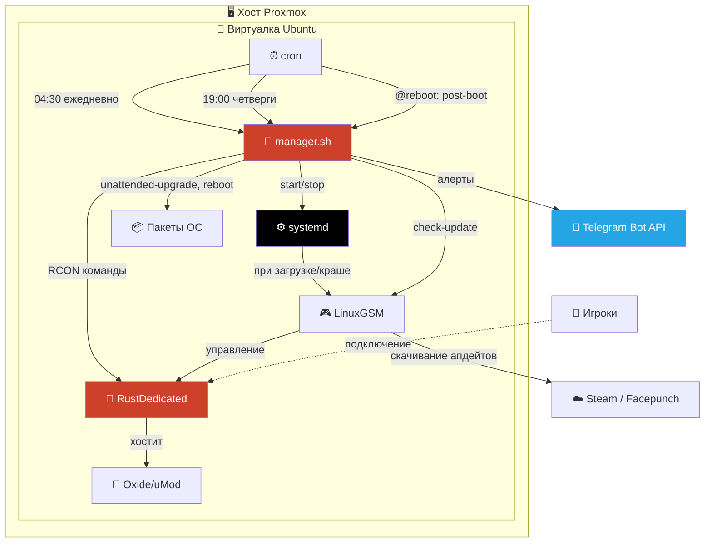
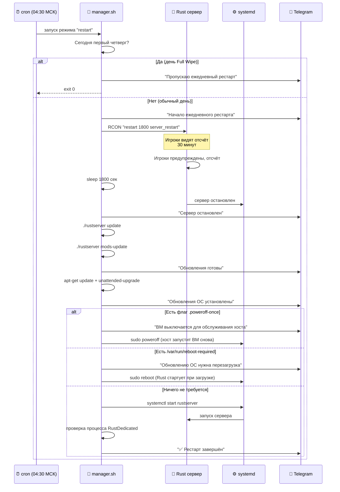
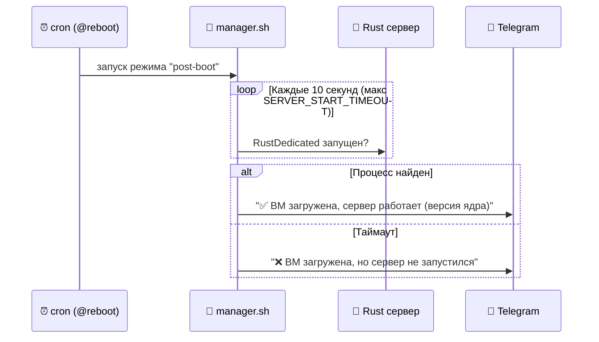
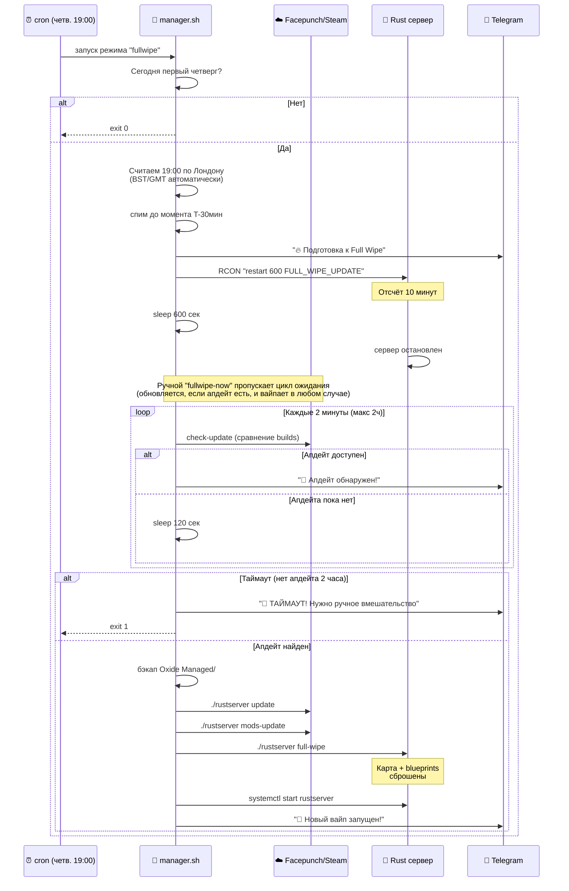

<div align="center">

# 🦀 Rust Wipe Manager

### Готовый к продакшену набор автоматизации для Rust-серверов на LinuxGSM

[](https://opensource.org/licenses/MIT)
[](https://www.gnu.org/software/bash/)
[](https://ubuntu.com/)
[](https://systemd.io/)
[](https://linuxgsm.com/)
[](https://telegram.org/)
[](https://rust.facepunch.com/)

**Ежедневные рестарты • Умный Full Wipe • Детектор обновлений • Telegram-алерты • Самовосстановление**

[🇬🇧 English](README.md) • [Возможности](#-возможности) • [Как работает](#-как-это-работает) • [Установка](#-установка) • [Конфигурация](#%EF%B8%8F-конфигурация) • [Решение проблем](#-решение-проблем)

</div>

---

## 📖 Обзор

**Rust Wipe Manager** — это полный набор автоматизации для серверов [Rust](https://rust.facepunch.com/), работающих на [LinuxGSM](https://linuxgsm.com/). Он берёт на себя всю рутину администрирования Rust-сервера: ежедневные рестарты, ежемесячные Full Wipe, синхронизированные с циклом обновлений Facepunch, восстановление после крашей, обновления ОС и подробные Telegram-уведомления на каждом шаге.

Тулкит написан и проверен в боевых условиях на реальном production-сервере (`bzod.ru`), работающем на **Ubuntu 24.04 LTS** + **Proxmox VM** + **LinuxGSM** + **uMod (Oxide)**.

## ✨ Возможности

### 🔄 Умные ежедневные рестарты
- Предупреждение игроков через RCON с обратным отсчётом (по умолчанию 30 минут)
- Корректное завершение работы с фолбэком на `systemctl stop` если процесс завис
- Автоматическое обновление Rust + Oxide во время рестарта
- Обновление пакетов ОС (`unattended-upgrade`) в том же окне, пока сервер остановлен
- Перезагружает ВМ вместо запуска сервера, если этого требует ОС (systemd-юнит поднимает Rust при загрузке)
- Одноразовый флаг выключения (`.poweroff-once`) для обслуживания на стороне хоста
- Сам пропускает себя в день Full Wipe, чтобы избежать конфликта

### 🔥 Автоматический Full Wipe в первый четверг каждого месяца
- Синхронизируется с официальным расписанием патчей Facepunch (19:00 по Лондону)
- **Ждёт реального появления апдейта в Steam** перед вайпом (риск вайпа на старой версии исключён)
- Опрашивает Steam каждые 2 минуты, до 2 часов
- Прерывает вайп с критическим Telegram-алертом, если апдейт не вышел вовремя
- Ручной `fullwipe-now` **не ждёт**: обновляется, если апдейт есть, и вайпает в любом случае
- Новый случайный сид карты при каждом Full Wipe (это делает LinuxGSM, если `seed` пустой, см. [Сид карты](#-сид-карты))
- Бэкапит директорию Oxide `Managed/` перед обновлением

### 🛡️ Интеграция с systemd
- Автозапуск при загрузке машины
- Автоперезапуск при краше (через LGSM monitor)
- Логи доступны через `journalctl -u rustserver`
- Чистый интерфейс `start`/`stop`/`restart`

### 📱 Telegram-уведомления на каждом шаге
- Старт рестарта / RCON отправлен / сервер остановлен / обновления готовы / сервер поднят
- После любой загрузки ВМ: сервер поднялся (с версией ядра) или не запустился (`post-boot`)
- Три уровня логирования: `full` / `success_error` / `error_only`
- Критические алерты при сбоях (таймаут, ошибка обновления, сервер не запустился)

### 🔐 Безопасность
- Все секреты хранятся в отдельном файле `.secrets.env` с правами `chmod 600`
- Sudo ограничен коротким списком команд: `systemctl` для сервиса, `apt-get update -qq`, `unattended-upgrade`, `reboot`, `poweroff`
- Никаких credentials в основном скрипте — безопасно публиковать

## 🏗️ Архитектура


```mermaid
graph TB
    subgraph "🖥️ Хост Proxmox"
        subgraph "🐧 Виртуалка Ubuntu"
            CRON[⏰ cron]
            SYSTEMD[⚙️ systemd]
            MANAGER[📜 manager.sh]
            LGSM[🎮 LinuxGSM]
            RUST[🦀 RustDedicated]
            OXIDE[🔧 Oxide/uMod]
            OS[📦 Пакеты ОС]
        end
    end

    TG[📱 Telegram Bot API]
    STEAM[☁️ Steam / Facepunch]
    PLAYERS[👥 Игроки]

    CRON -->|"04:30 ежедневно"| MANAGER
    CRON -->|"19:00 четверги"| MANAGER
    CRON -->|"@reboot: post-boot"| MANAGER
    SYSTEMD -->|"при загрузке/краше"| LGSM
    MANAGER -->|"start/stop"| SYSTEMD
    MANAGER -->|"RCON команды"| RUST
    MANAGER -->|"check-update"| LGSM
    MANAGER -->|"unattended-upgrade, reboot"| OS
    MANAGER -->|"алерты"| TG
    LGSM -->|"скачивание апдейтов"| STEAM
    LGSM -->|"управление"| RUST
    RUST -->|"хостит"| OXIDE
    PLAYERS -.->|"подключение"| RUST

    style MANAGER fill:#CD412B,color:#fff
    style RUST fill:#CD412B,color:#fff
    style TG fill:#26A5E4,color:#fff
    style SYSTEMD fill:#000,color:#fff
```

## 🎯 Как это работает

### Сценарий ежедневного рестарта


```mermaid
sequenceDiagram
    participant C as ⏰ cron (04:30 МСК)
    participant M as 📜 manager.sh
    participant R as 🦀 Rust сервер
    participant S as ⚙️ systemd
    participant T as 📱 Telegram

    C->>M: запуск режима "restart"
    M->>M: Сегодня первый четверг?
    alt Да (день Full Wipe)
        M->>T: "Пропускаю ежедневный рестарт"
        M-->>C: exit 0
    else Нет (обычный день)
        M->>T: "Начало ежедневного рестарта"
        M->>R: RCON "restart 1800 server_restart"
        Note over R: Игроки видят отсчёт<br/>30 минут
        R->>R: Игроки предупреждены, отсчёт
        M->>M: sleep 1800 сек
        R->>S: сервер остановлен
        M->>T: "Сервер остановлен"
        M->>M: ./rustserver update
        M->>M: ./rustserver mods-update
        M->>T: "Обновления готовы"
        M->>M: apt-get update + unattended-upgrade
        M->>T: "Обновления ОС установлены"
        alt Есть флаг .poweroff-once
            M->>T: "ВМ выключается для обслуживания хоста"
            M->>S: sudo poweroff (хост запустит ВМ снова)
        else Есть /var/run/reboot-required
            M->>T: "Обновлению ОС нужна перезагрузка"
            M->>S: sudo reboot (Rust стартует при загрузке)
        else Ничего не требуется
            M->>S: systemctl start rustserver
            S->>R: запуск сервера
            M->>M: проверка процесса RustDedicated
            M->>T: "✅ Рестарт завершён"
        end
    end
```

Шаги обслуживания ОС (`update_system`, `reboot_if_required`) выполняются после обновления Rust/Oxide, пока сервер остановлен:

- **Обновления ОС** — `apt-get update -qq` + `unattended-upgrade`, включаются параметром `SYSTEM_UPDATE_ENABLED`. Чтобы обновления ставились только в этом окне, отключи штатный таймер apt (см. «Установка», шаг 4).
- **Перезагрузка** — параметр `REBOOT_IF_REQUIRED`. Если есть `/var/run/reboot-required`, ВМ перезагружается вместо запуска сервера; systemd-юнит поднимает Rust при загрузке.
- **Одноразовое выключение** — `touch ~/rust_server/.poweroff-once`: при ближайшем ежедневном рестарте ВМ выключится вместо запуска сервера (для обслуживания на стороне хоста, например `qm enroll-efi-keys <vmid>` в Proxmox, которому нужна выключенная ВМ). Флаг удаляется при использовании, а запустить ВМ снова должен хост.

### Отчёт после загрузки


```mermaid
sequenceDiagram
    participant C as ⏰ cron (@reboot)
    participant M as 📜 manager.sh
    participant R as 🦀 Rust сервер
    participant T as 📱 Telegram

    C->>M: запуск режима "post-boot"
    loop Каждые 10 секунд (макс SERVER_START_TIMEOUT)
        M->>R: RustDedicated запущен?
    end
    alt Процесс найден
        M->>T: "✅ ВМ загружена, сервер работает (версия ядра)"
    else Таймаут
        M->>T: "❌ ВМ загружена, но сервер не запустился"
    end
```

### Сценарий Full Wipe


```mermaid
sequenceDiagram
    participant C as ⏰ cron (четв. 19:00)
    participant M as 📜 manager.sh
    participant FP as ☁️ Facepunch/Steam
    participant R as 🦀 Rust сервер
    participant T as 📱 Telegram

    C->>M: запуск режима "fullwipe"
    M->>M: Сегодня первый четверг?
    alt Нет
        M-->>C: exit 0
    else Да
        M->>M: Считаем 19:00 по Лондону<br/>(BST/GMT автоматически)
        M->>M: спим до момента T-30мин
        M->>T: "🔥 Подготовка к Full Wipe"
        M->>R: RCON "restart 600 FULL_WIPE_UPDATE"
        Note over R: Отсчёт 10 минут
        M->>M: sleep 600 сек
        R->>R: сервер остановлен

        Note over M,FP: Ручной "fullwipe-now" пропускает цикл ожидания<br/>(обновляется, если апдейт есть, и вайпает в любом случае)
        loop Каждые 2 минуты (макс 2ч)
            M->>FP: check-update (сравнение builds)
            alt Апдейт доступен
                M->>T: "🎉 Апдейт обнаружен!"
            else Апдейта пока нет
                M->>M: sleep 120 сек
            end
        end

        alt Таймаут (нет апдейта 2 часа)
            M->>T: "🚨 ТАЙМАУТ! Нужно ручное вмешательство"
            M-->>C: exit 1
        else Апдейт найден
            M->>M: бэкап Oxide Managed/
            M->>FP: ./rustserver update
            M->>FP: ./rustserver mods-update
            M->>R: ./rustserver full-wipe
            Note over R: Карта + blueprints<br/>сброшены
            M->>R: systemctl start rustserver
            M->>T: "🎉 Новый вайп запущен!"
        end
    end
```

> 💡 Цикл ожидания относится к плановому `fullwipe` (первый четверг). Ручной `fullwipe-now` не ждёт Facepunch: он выполняет `./rustserver update` (тот обновляет, только если вышла новая сборка) и затем вайпает в любом случае.

## 🛠️ Технологии

| Компонент | Назначение |
|---|---|
|  | Основной язык скриптов |
|  | Хостовая ОС |
|  | Управление сервисами и автозапуск |
|  | Обёртка для игрового сервера |
|  | Сама игра |
|  | Фреймворк плагинов |
|  | Планировщик задач |
|  | RCON-клиент |
|  | Уведомления |

## 📋 Требования

- **ОС**: Ubuntu 24.04 LTS (или любой современный Debian-based дистрибутив с systemd)
- **LinuxGSM** установлен и `rustserver` настроен в `~/rustserver`
- **Rust dedicated server** работает через LGSM
- **systemd** (есть во всех современных дистрибутивах)
- **rcon-cli** от gorcon: [github.com/gorcon/rcon-cli](https://github.com/gorcon/rcon-cli)
- **Telegram-бот** (опционально, но рекомендуется) — токен у [@BotFather](https://t.me/BotFather)
- **sudo** права для пользователя сервера (ограниченные `systemctl`, `apt-get update -qq`, `unattended-upgrade`, `reboot`, `poweroff`)

## 🚀 Установка

### 1️⃣ Установить LinuxGSM и Rust-сервер

```bash
curl -Lo linuxgsm.sh https://linuxgsm.sh && chmod +x linuxgsm.sh && bash linuxgsm.sh rustserver
./rustserver auto-install
```

### 2️⃣ Установить rcon-cli

```bash
cd ~
wget https://github.com/gorcon/rcon-cli/releases/download/v0.10.3/rcon-0.10.3-amd64_linux.tar.gz
tar -xzf rcon-0.10.3-amd64_linux.tar.gz
rm rcon-0.10.3-amd64_linux.tar.gz
```

### 3️⃣ Настроить systemd-сервис

Создать `/etc/systemd/system/rustserver.service`:

```ini
[Unit]
Description=Rust Server (LinuxGSM)
After=network-online.target
Wants=network-online.target

[Service]
Type=oneshot
RemainAfterExit=yes
User=YOUR_USERNAME
Group=YOUR_USERNAME
WorkingDirectory=/home/YOUR_USERNAME
ExecStart=/home/YOUR_USERNAME/rustserver start
ExecStop=/home/YOUR_USERNAME/rustserver stop
TimeoutStartSec=600
TimeoutStopSec=300

[Install]
WantedBy=multi-user.target
```

Включить и запустить:
```bash
sudo systemctl daemon-reload
sudo systemctl enable rustserver
sudo systemctl start rustserver
```

> ⚠️ **Почему `Type=oneshot`, а не `Type=forking`?** LinuxGSM использует tmux внутри и отделяет процесс. С `Type=forking` systemd теряет связь с реальным процессом сервера. `Type=oneshot` + `RemainAfterExit=yes` — самое чистое решение, которое надёжно работает с LGSM.

### 4️⃣ Настроить sudoers (sudo без пароля для systemctl, apt, reboot)

```bash
echo 'YOUR_USERNAME ALL=(root) NOPASSWD: /usr/bin/systemctl start rustserver, /usr/bin/systemctl stop rustserver, /usr/bin/systemctl restart rustserver, /usr/bin/apt-get update -qq, /usr/bin/unattended-upgrade, /usr/sbin/reboot, /usr/sbin/poweroff' | sudo tee /etc/sudoers.d/YOUR_USERNAME-rustserver
sudo chmod 440 /etc/sudoers.d/YOUR_USERNAME-rustserver
```

**Рекомендуется:** отключить штатный таймер unattended-upgrade, чтобы обновления ОС ставились только в окне ежедневного рестарта, пока сервер остановлен. В `/etc/apt/apt.conf.d/20auto-upgrades` оставь обновление списка пакетов и выключи периодическую установку:

```
APT::Periodic::Update-Package-Lists "1";
APT::Periodic::Unattended-Upgrade "0";
```

### 5️⃣ Скачать репозиторий

```bash
mkdir -p ~/rust_server
cd ~/rust_server
wget https://raw.githubusercontent.com/wobujidao/rust-wipe-manager/main/manager.sh
wget https://raw.githubusercontent.com/wobujidao/rust-wipe-manager/main/config.env.example -O config.env
wget https://raw.githubusercontent.com/wobujidao/rust-wipe-manager/main/secrets.env.example -O .secrets.env
chmod +x manager.sh
chmod 600 .secrets.env
```

### 6️⃣ Настроить секреты и конфиг

Отредактировать `.secrets.env` реальными значениями:
```bash
nano ~/rust_server/.secrets.env
```

```env
TELEGRAM_BOT_TOKEN="123456789:AAAAAAAAAAAAAAAAAAAAAAAAAAAAAAAAAAA"
TELEGRAM_CHAT_ID="-1001234567890"
RCON_PASS="ваш_rcon_пароль"
```

Отредактировать `config.env` под свои пути и предпочтения:
```bash
nano ~/rust_server/config.env
```

### 7️⃣ Протестировать

```bash
~/rust_server/manager.sh test-telegram
~/rust_server/manager.sh check-update
```

Должно прийти сообщение в Telegram и вывестись информация о версиях из Steam.

### 8️⃣ Добавить задачи в cron

```bash
crontab -e
```

Добавить:
```cron
30 4 * * * /home/YOUR_USERNAME/rust_server/manager.sh restart >> /home/YOUR_USERNAME/rust_server/logs/cron.log 2>&1
0 19 * * 4 /home/YOUR_USERNAME/rust_server/manager.sh fullwipe >> /home/YOUR_USERNAME/rust_server/logs/cron.log 2>&1
@reboot /home/YOUR_USERNAME/rust_server/manager.sh post-boot >> /home/YOUR_USERNAME/rust_server/logs/cron.log 2>&1
```

> 💡 Задача Full Wipe запускается **каждый четверг** в 19:00, но скрипт сам проверяет, является ли сегодня первым четвергом месяца, и в обычные четверги сразу выходит. В первый четверг он спит до момента (`FULLWIPE_LONDON_HOUR` по Лондону − `FULLWIPE_PRE_WAIT_MINUTES`) и только тогда начинает подготовку.

> 🕒 Время в cron — по **локальному часовому поясу ВМ**.

> 📣 Запись `@reboot` запускает `post-boot` после каждой загрузки ВМ (включая перезагрузки и включения после ежедневного рестарта) и сообщает в Telegram, поднялся ли сервер.

## ⚙️ Конфигурация

Все настройки находятся в `config.env`. Самые важные:

| Параметр | По умолчанию | Описание |
|---|---|---|
| `DAILY_RESTART_COUNTDOWN` | `1800` | Отсчёт перед ежедневным рестартом (секунд) |
| `DAILY_RESTART_UPDATE_RUST` | `true` | Обновлять Rust при ежедневном рестарте |
| `DAILY_RESTART_UPDATE_OXIDE` | `true` | Обновлять Oxide при ежедневном рестарте |
| `FULLWIPE_COUNTDOWN` | `600` | Отсчёт перед остановкой при Full Wipe (секунд) |
| `FULLWIPE_LONDON_HOUR` | `19` | Час по Лондону, когда Facepunch выпускает апдейты |
| `FULLWIPE_PRE_WAIT_MINUTES` | `30` | За сколько минут до апдейта начать подготовку |
| `FULLWIPE_UPDATE_WAIT_MAX` | `7200` | Макс. время, которое плановый `fullwipe` ждёт апдейт Steam (секунд); `fullwipe-now` не ждёт |
| `FULLWIPE_UPDATE_CHECK_INTERVAL` | `120` | Проверять Steam каждые N секунд |
| `SKIP_DAILY_RESTART_ON_FULLWIPE_DAY` | `true` | Пропускать ежедневный рестарт в день Full Wipe |
| `OXIDE_BACKUP_BEFORE_UPDATE` | `true` | Бэкапить `Managed/` перед обновлением Oxide |
| `SYSTEM_UPDATE_ENABLED` | `true` | Выполнять `apt-get update` + `unattended-upgrade` в окне ежедневного рестарта (сервер остановлен) |
| `REBOOT_IF_REQUIRED` | `true` | Если ОС требует перезагрузку — перезагрузить ВМ вместо запуска сервера |
| `SERVER_START_TIMEOUT` | `600` | Макс. время ожидания процесса RustDedicated (используется и в `post-boot`) |
| `ENABLE_TELEGRAM` | `true` | Включить Telegram-уведомления |
| `TELEGRAM_LOG_LEVEL` | `full` | `full` / `success_error` / `error_only` |

### 🌱 Сид карты

Сид менеджер не трогает — этим занимается LinuxGSM. Если в `lgsm/config-lgsm/rustserver/rustserver.cfg` указано `seed=""`, то `full-wipe` в LGSM записывает новый случайный сид в `lgsm/data/rustserver-seed.txt`, и следующий запуск использует его.

- LGSM вайпает (и меняет сид) только если существует файл `.map`/`.sav`; иначе он пишет «Wipe not required», и сид остаётся прежним.
- Один только принудительный апдейт Facepunch стирает карту (повышается версия сохранений), но сид остаётся тем же, поэтому рельеф повторяется. Сид меняет только `full-wipe` в LGSM.

## 🎮 Команды

```bash
# Ежедневный рестарт (с авто-пропуском в день Full Wipe), плюс обновления ОС / перезагрузка
./manager.sh restart

# Full Wipe (запустится только если сегодня первый четверг; ждёт апдейт Facepunch)
./manager.sh fullwipe

# Ручной Full Wipe — пропускает проверку даты и не ждёт апдейт Facepunch
# (обновляется, если апдейт есть, и вайпает в любом случае) (ОСТОРОЖНО)
./manager.sh fullwipe-now

# Отчёт о состоянии сервера после загрузки ВМ (для записи @reboot в cron)
./manager.sh post-boot

# Тест Telegram-уведомлений
./manager.sh test-telegram

# Проверить наличие апдейта Rust в Steam
./manager.sh check-update
```

Одноразовое выключение при ближайшем ежедневном рестарте (обслуживание на стороне хоста):
```bash
touch ~/rust_server/.poweroff-once
```
ВМ выключится вместо запуска сервера, флаг удаляется при использовании, а запустить ВМ снова должен хост.

## 📁 Структура проекта

```
rust_server/
├── manager.sh           # Главный скрипт
├── config.env           # Конфигурация (пути, тайминги, флаги)
├── .secrets.env         # Telegram токен, RCON пароль (chmod 600)
├── .poweroff-once       # Необязательный одноразовый флаг выключения (удаляется при использовании)
└── logs/
    ├── manager-YYYYMMDD.log
    └── cron.log
```

## 🔧 Решение проблем

### Сервер не поднимается автоматически после ребута
Проверь systemd-юнит:
```bash
sudo systemctl status rustserver
sudo systemctl is-enabled rustserver
journalctl -u rustserver -n 50
```
Убедись, что он `enabled` и используется `Type=oneshot` (а не `forking`).

### `sudo: a password is required` из cron
Правило `sudoers.d/` не применилось корректно. Проверь:
```bash
sudo -n systemctl status rustserver
```
Должно показать статус без запроса пароля. `sudo -n -l` покажет разрешённые команды — в списке должны быть и `apt-get update -qq`, `unattended-upgrade`, `reboot`, `poweroff`, иначе шаг обслуживания ОС завершится алертом «OS update error».

### `find: Failed to restore initial working directory`
`find` в LinuxGSM падает, если унаследованный рабочий каталог нечитаем — обычно при запуске через `sudo -u YOUR_USERNAME` из домашней папки другого пользователя. Теперь `manager.sh` при старте сам переходит в свой каталог, так что для скрипта это исправлено. Ручные команды LGSM запускай от пользователя сервера из его домашней папки:
```bash
sudo -iu YOUR_USERNAME
./rustserver details
```

### ВМ выключилась после ежедневного рестарта и не включилась
Это сработал флаг `.poweroff-once`: ВМ выключается намеренно, чтобы хост мог провести обслуживание, и запустить её снова должен хост. Флаг удаляется при использовании, так что следующий ежедневный рестарт пройдёт как обычно.

### Full Wipe запустился, но сервер на старой версии
Цикл `wait_for_rust_update` должен это предотвратить для планового `fullwipe`. Ручной `fullwipe-now` не ждёт, поэтому вайпнет на старой версии, если Facepunch ещё не выпустил апдейт. Если это всё-таки случилось при плановом запуске:
1. Посмотри `~/rust_server/logs/manager-*.log` на этапе ожидания
2. Проверь вручную, что `check-update` корректно возвращает номера build
3. Увеличь `FULLWIPE_UPDATE_WAIT_MAX`, если Facepunch особо опаздывает

### Oxide не загружается после Full Wipe
Релизы Oxide иногда задерживаются на 30-90 минут после релизов Rust. Если `mods-update` отработал слишком рано — может быть скачана несовместимая версия. Решения:
- Подожди 30 минут и запусти `~/rustserver mods-update` вручную, потом перезапусти сервер
- Восстанови из автобэкапа: `~/serverfiles/RustDedicated_Data/Managed.backup-YYYY-MM-DD/`

### Сообщения Telegram не приходят
```bash
~/rust_server/manager.sh test-telegram
```
Если ничего не приходит, проверь:
- Корректный токен бота в `.secrets.env`
- Корректный chat ID (отрицательный для групп, положительный для личных чатов)
- Бот добавлен в группу/канал
- `curl https://api.telegram.org/botYOUR_TOKEN/getMe` возвращает `"ok":true`

## 🗺️ Планы развития

- [ ] Поддержка Discord webhook (вместе с Telegram)
- [ ] Веб-дашборд для просмотра логов
- [x] Автоматическая ротация сидов карт — делает LinuxGSM, см. [Сид карты](#-сид-карты)
- [ ] Интеграция с `BattleMetrics` API для алертов по онлайну
- [ ] Уведомления об апдейтах популярных плагинов
- [ ] Поддержка нескольких серверов (один менеджер, много серверов)

## 🤝 Вклад в проект

PR и issue приветствуются. Этот проект сделан для реальной боевой эксплуатации, поэтому, пожалуйста, тестируй изменения на реальном LGSM Rust-сервере перед PR.

## 📜 Лицензия

MIT — делай с этим кодом что хочешь, только не вини меня, если твой сервер взорвётся.

## 🙏 Благодарности

- [LinuxGSM](https://linuxgsm.com/) — невоспетый герой хостинга игровых серверов
- [gorcon/rcon-cli](https://github.com/gorcon/rcon-cli) — чистый RCON-клиент
- [Facepunch Studios](https://facepunch.com/) — за создание Rust
- [uMod / Oxide](https://umod.org/) — за экосистему плагинов

---

<div align="center">

Если это сэкономило тебе время — поставь ⭐ репозиторию!

</div>
